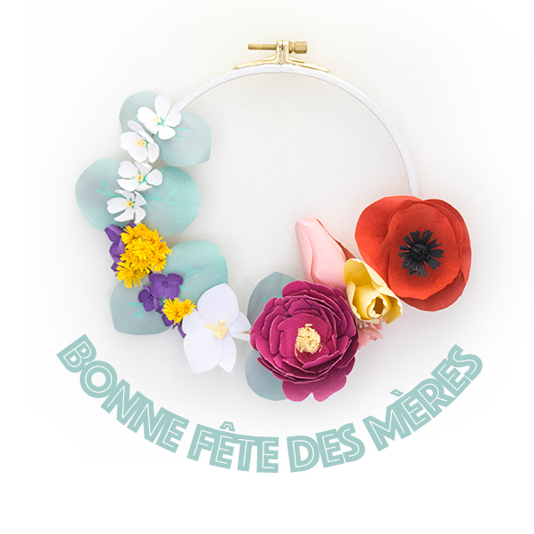
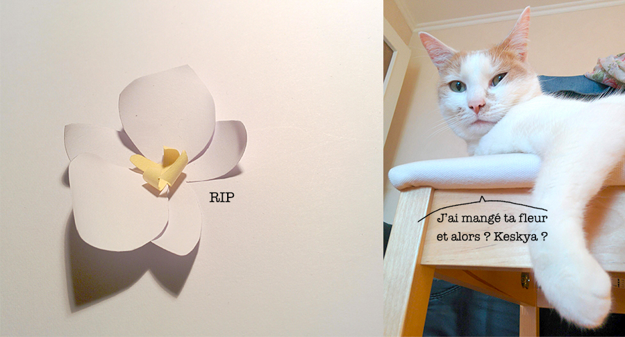
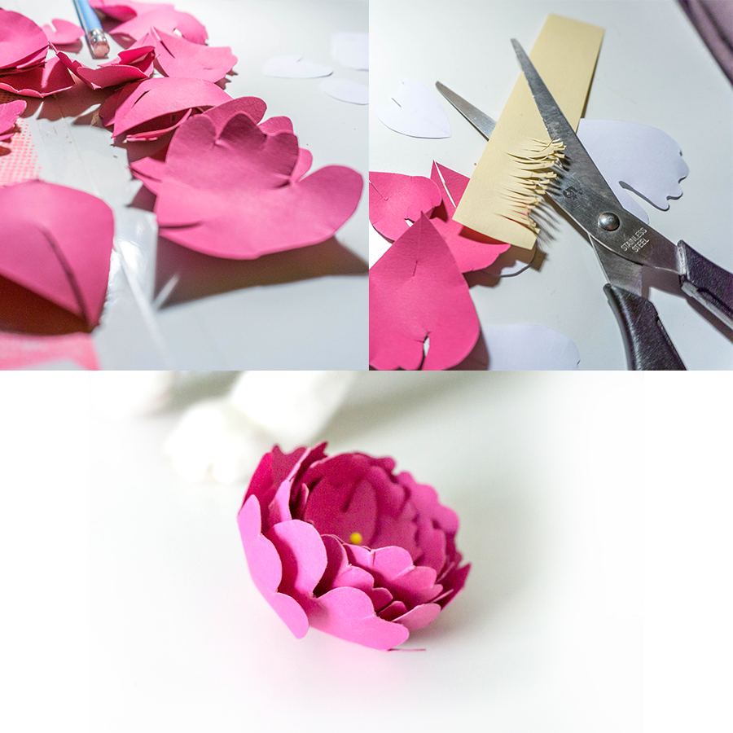
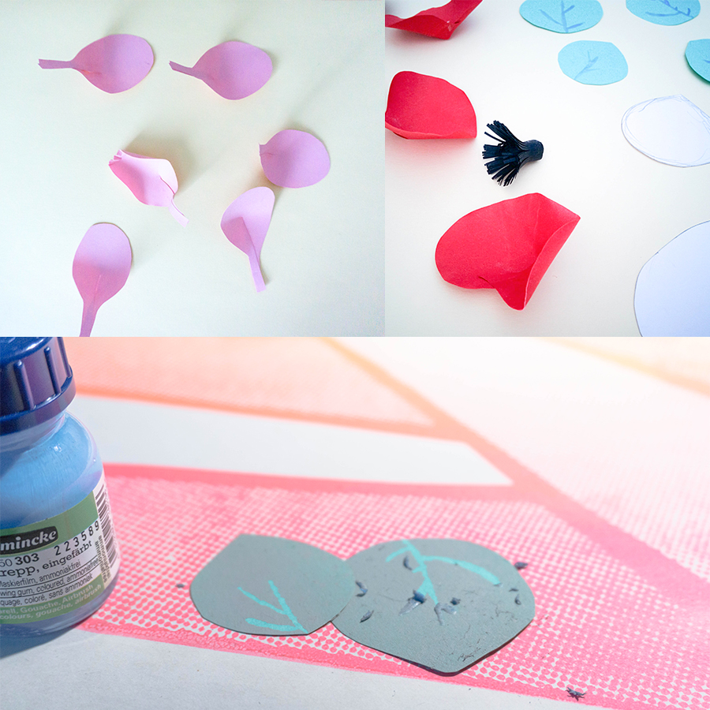
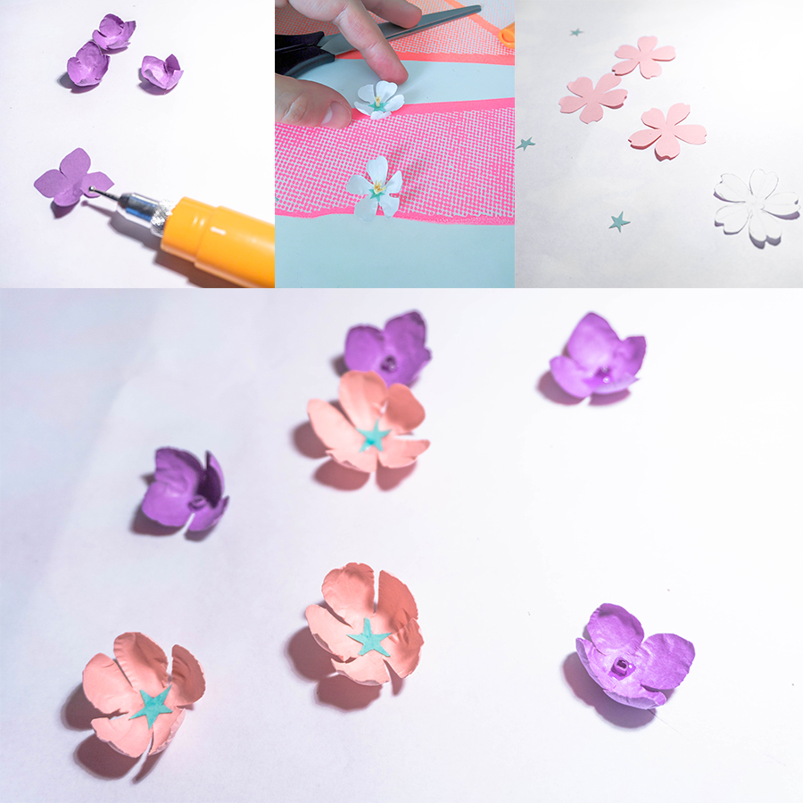
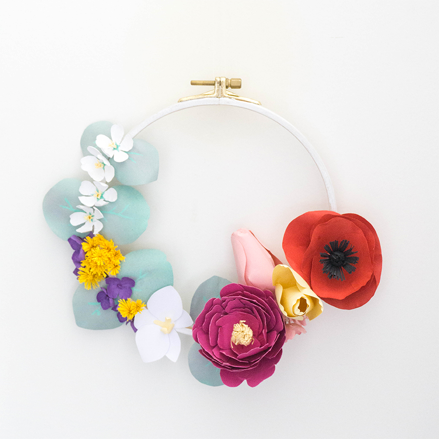
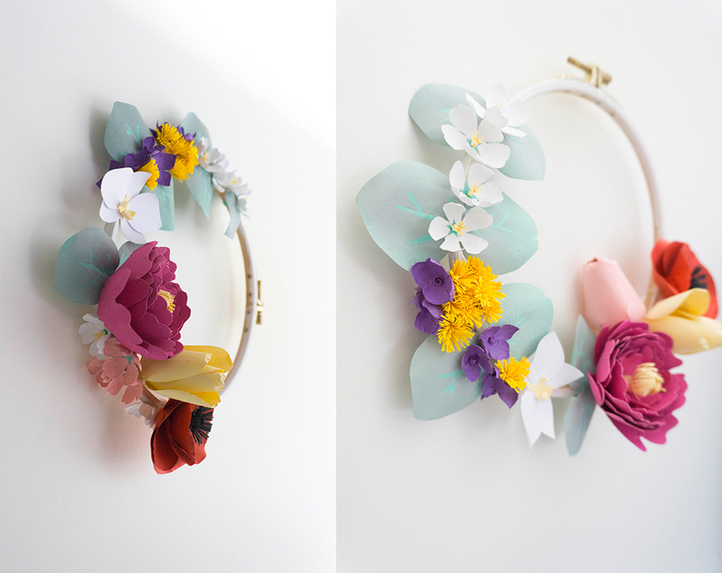

Pour moi, c'est souvent synonyme de DIY. Cette année j'ai eu envie de créer une couronne de fleurs (c'est tendance!) mais avec des fleurs qui ne fanent pas.

<!--more-->

### Matériel

Pour réaliser cette couronne, j'ai utilisé : - un cercle à broder (qui va servir de support) - des feuilles de couleur épaisses (type canson), j'ai essayé avec du 120g/m2 et du 270g/m2, j'ai préféré manipuler les plus fines - de la colle à papier - un pistolet à colle - une paire de ciseaux - de la gomme liquide (pour aquarelle) - un spray peinture gris clair - un stylo à embossage

### L'orchidée

C'est la première fleur que j'ai tenté de faire. Ça ne semblait pas sorcier d'après ce tuto : [http://verob.centerblog.net/8600-orchidee-en-papier](http://verob.centerblog.net/8600-orchidee-en-papier). La surprise, c'est que le chat l'a mangée et que j'ai dû en refaire une deuxième…

### La pivoine

J'ai suivi le tuto suivant [http://www.freeprettythingsforyou.com/2017/11/free-paper-peony-template/](http://www.freeprettythingsforyou.com/2017/11/free-paper-peony-template/). Pour le coeur de la fleur (pistil & étamines) j'ai découpé une bande de papier jaune pâle et j'ai coupé de fines dents sur l'un des côtés. Ensuite j'ai étalé un peu de colle à papier tout le long et je l'ai enroulée sur elle-même.

J'ai réutilisé cette technique pour les autres fleurs, avec du papier noir pour le coquelicot, puis avec du jaune vif pour faire des fleurs de mimosa. 

### Un peu de verdure

Un autre élément tendance c'est l'eucalyptus. Je voulais donner l'impression d'y avoir glissé une branche. J'ai dessiné à la main les formes de feuilles que je voulais, d'après des photos comme ici [https://www.pinterest.fr/pin/244601823496055562/](https://www.pinterest.fr/pin/244601823496055562/) Je n'avais pas de papier de cette couleur si particulière qu'ont les feuilles d'eucalyptus, alors j'ai pris un papier vert-pomme et j'ai tracé des nervures avec la gomme liquide (j'ai laissé sécher). Ensuite j'ai appliqué une fine pellicule de peinture en spray gris. Une fois sec, j'ai enlevé la gomme qui s'était solidifiée et les nervures sont apparues :)

### Les tulipes

Un tuto vidéo est disponible ici [https://www.dreamyposy.com/diy-paper-tulip-bouquet/](https://www.dreamyposy.com/diy-paper-tulip-bouquet/). J'ai pas mal pesté avant d'arriver à assembler mes tulipes (rose et jaune pâles) comme je le voulais.

### Le coquelicot

Je n'ai pas trouvé de tuto ni de template de coquelicot. J'ai fait une recherche Google image pour observer la forme des pétales, leur nombre, puis j'ai réutilisé les techniques déjà vues pour la pivoine et les tulipes qui permettent de donner du volume aux pétales, puis à les coller ensemble progressivement. J'ai fixé les étamines noires à la fin, lorsque tout tenait déjà en place sur cette fleur.

### Les petites fleurs

Pas de template non plus pour les fleurs de cerisier. J'ai du improviser ! En revanche, pour l'hortensia, je me suis inspirée de ce tuto : [https://liagriffith.com/make-a-diy-paper-hydrangea-wreath-for-fall/](https://liagriffith.com/make-a-diy-paper-hydrangea-wreath-for-fall/)

### Assemblage

J'ai collé au pistolet à colle les feuilles deux par deux, plutôt espacées, sur le côté gauche du cercle. Avant de constituer une petite nuée jaune avec le mimosa, j'ai ajouté les plus grosses fleurs. Enfin, j'ai meublé les espaces vides ou les parties de colle un peu trop visibles avec des fleurs plus petites (violettes façon hortensia, blanches et roses façon fleur de cerisier).

Et voilà ! Bonne fête maman !
