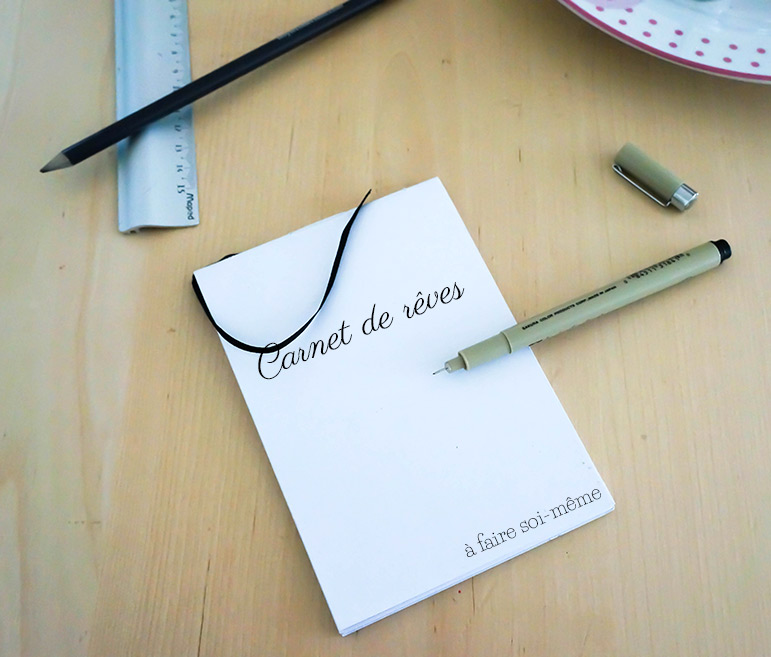
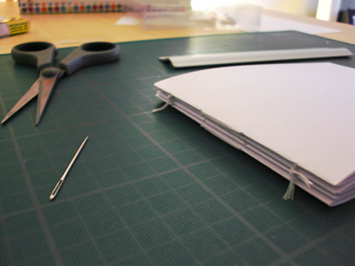
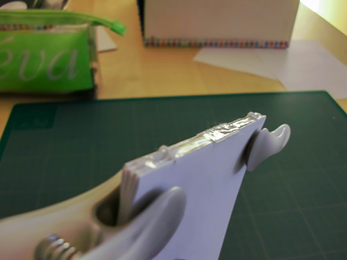
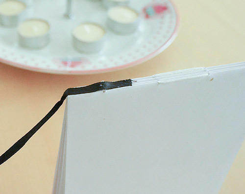
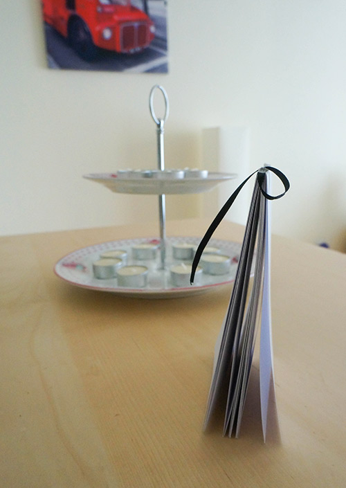
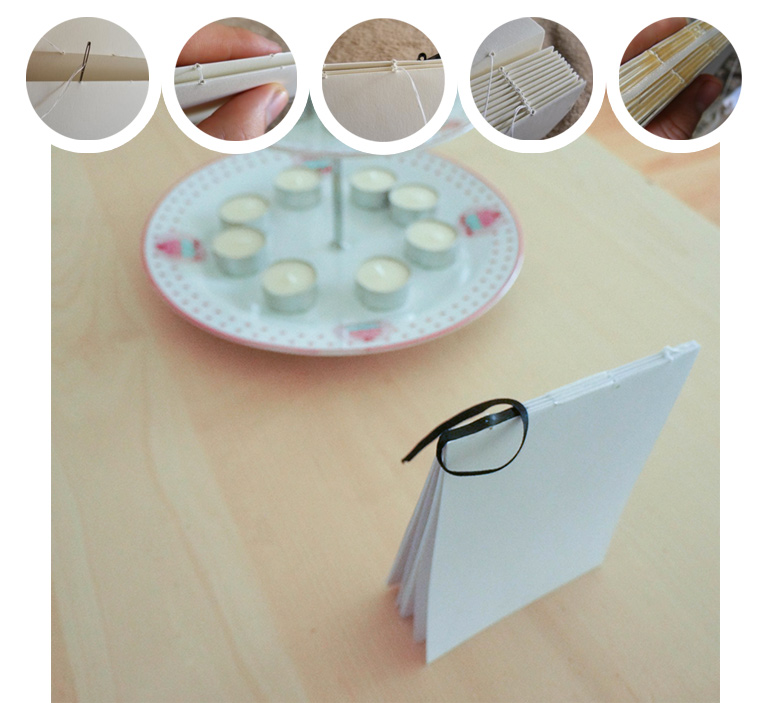
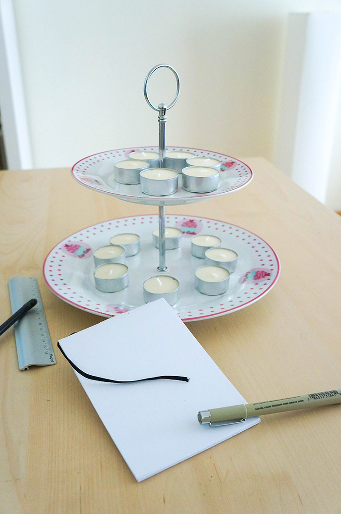

Aujourd'hui, ce n'est pas tout à fait un DIY :  je vous montre le carnet que j'ai fait grâce à deux tutos trouvés sur le [deviantart de JamesDarrow](http://jamesdarrow.deviantart.com/art/Bookbinding-Tutorial-292237490?q=boost:popular%20meta:all%20max_age:24h&qo=22 "Bookbinding tutorial") et [le site Design And Paper](http://www.designandpaper.com/?p=2725). Je me suis arrêtée avant l'étape de création de la couverture pour garder un carnet souple

Matériel nécessaire :

## Quelques feuilles A4 + 1 règle + 1 crayon + 1 aiguille + du fil + de la colle liquide + 1 ruban (qui sera le marque-page) + 2 pinces

 

Tous à vos tubes de colle !
