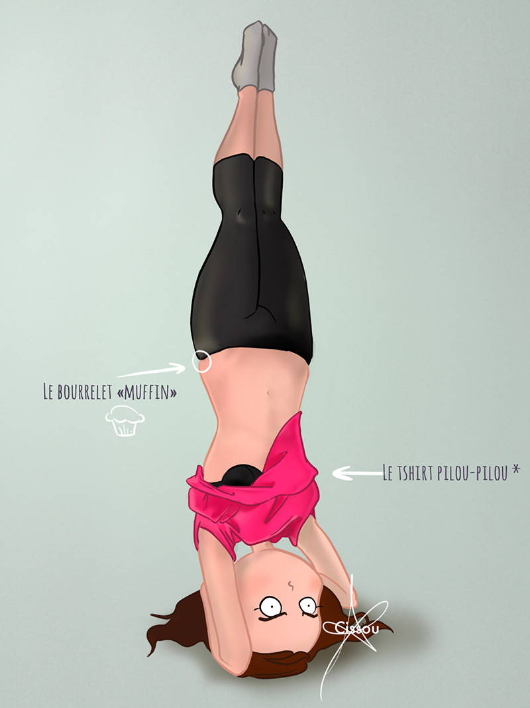

...c'est qu'on peut être ridicule en faisant du yoga, parfois.

 \* pilou-pilou : adj. Se dit d'un vêtement confortable, qui ne correspond pas nécessairement aux critères de la mode. (Merci aux filles du market pour ce nouveau mot dans mon vocabulaire :) ) Autrement dit, dans notre cas, ma première tentative de supported headstand pose, je l'ai faite avec un tshirt trop large. Et je m'en suis rendue compte une fois "à l'envers" (par la force des choses).

\[J'en ai profité pour peaufiner un peu la colo du dessin.\]
