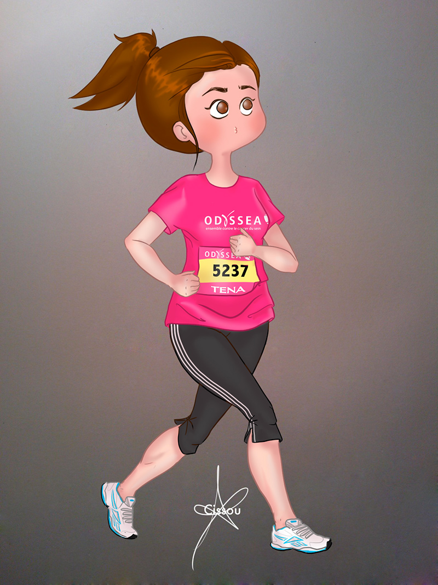

Le 6 octobre dernier j'ai participé à la course 5km organisée au parc de Vincennes par [Odyssea](http://www.odyssea.info/paris/ "Odyssea Paris"), une association qui lutte contre le cancer du sein en organisant des weekends sportifs à l'échelle nationale.

Résultat : je suis rentrée avec les joues écarlates et un t-shirt fushcia dont le sponsor officiel est TENA. Glamour !

Dis donc toi ! Oui toi gentil lecteur, à l'occasion d'octobre rose (ou n'importe quand dans l'année) mobilise-toi :) Sors tes baskets, c'est bon pour ta santé et ça vaut quand même bien mieux qu'on [**statut facebook à trois francs**](http://obsession.nouvelobs.com/high-tech/20111107.OBS3982/nouveau-buzz-a-destination-des-femmes-sur-facebook.html "Statut facebook lutte contre le cancer") (ce buzz contre lequel je m'insurge chaque année, bisous quoi) !
