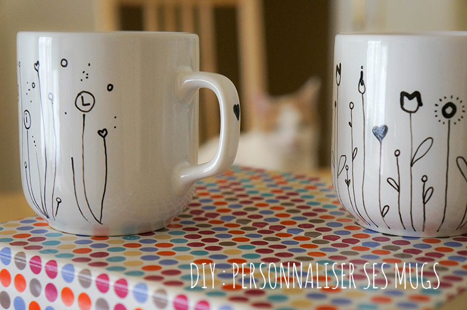
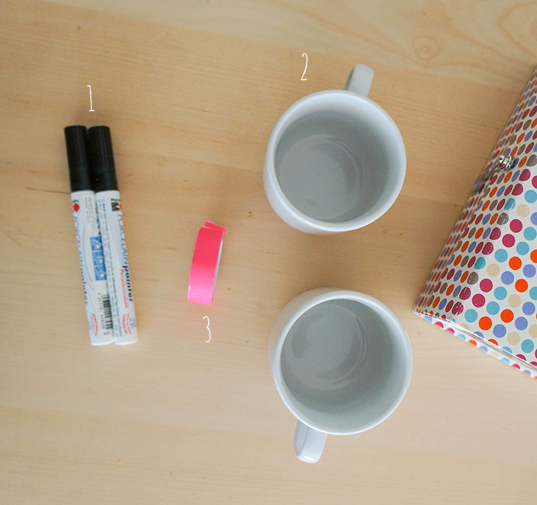
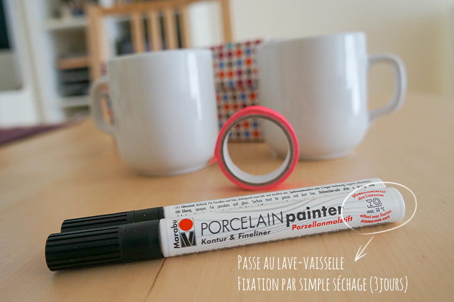
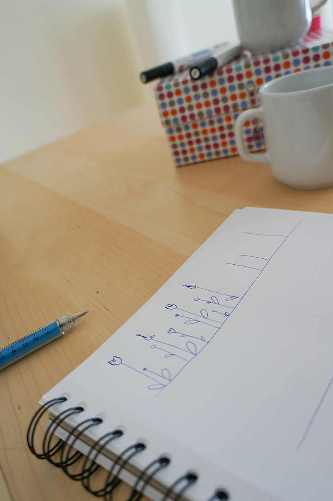
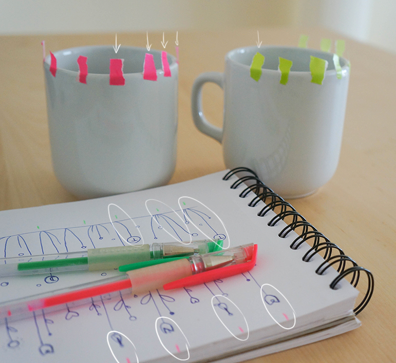
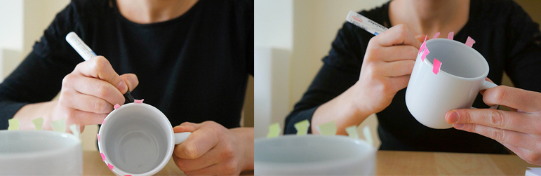
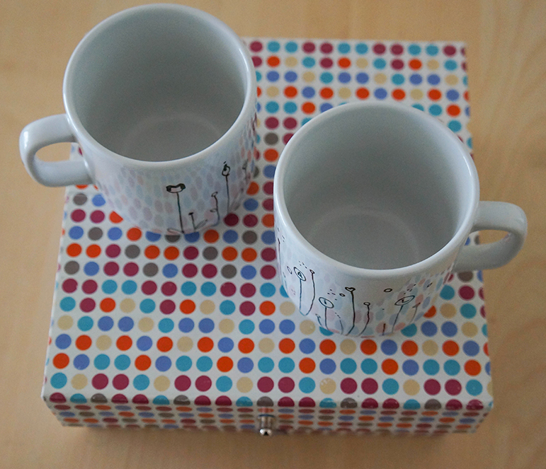
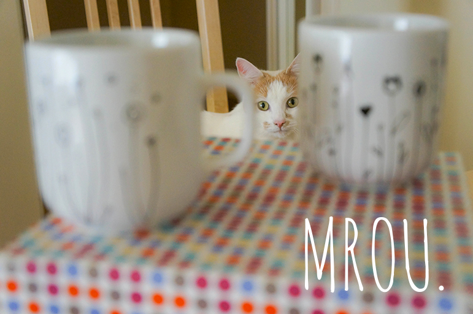

Matériel nécessaire :

## 1\. Un feutre à porcelaine \*+ 2. Un/des mugs(s) à personnaliser + 3. (optionnel) Du masking tape, un carnet et des stylos : pour faire des croquis avant de les répartir sur la circonférence du mug.

\* Trouvés dans un Rougier & Plé / Magasin de fournitures de metiers d'Art et loisirs créatifs . J'ai pris deux épaisseurs de pointe différentes.

1\. Préparer le motif à dessiner. Je voulais leur donner un aspect champêtre et floral, alors allons-y pour les tiges !

2\. Ensuite, pour assurer une bonne répartition des éléments (lettres ou fleurs) sur la circonférence des mugs, tracer des marqueurs sur le croquis et appliquer autant de bouts de masking tape sur le haut de la tasse. Ils serviront de guides au moment du tracé définitif.

3\. Nettoyer le mug avec un coton imbibé d'alcool , laisser sécher. Reproduire le dessin sur la tasse. **Astuce**, procéder de gauche à droite pour éviter de mettre les doigts sur vos dessins et de faire des tâches d'encre sur le mug. **En cas de tâche/boulette**, avant que ça sèche, nettoyer délicatement avec le coton alcoolisé.

4\. Enlever les bouts de masking tape (sans toucher aux dessins) et laisser sécher à l'air libre pendant 3 jours. Et voilà !

