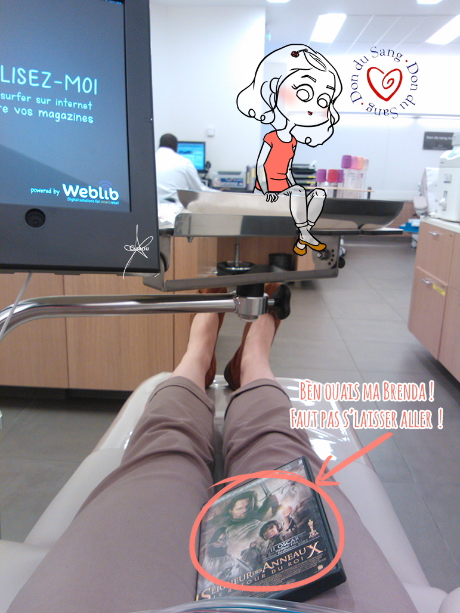

Bonjour-bonjour !

En exclusivité, l'actu de la semaine : j'ai fait un don de plaquettes. Pour ceux qui n'y connaissent pas grand chose (comme moi jusqu'à très récemment), les plaquettes permettent au sang de coaguler et elles se conservent peu de temps (5 jours). Le prélèvement dure 1h30 et pour patienter, on peut apporter son livre, son téléphone ou alors, [l'EFS](http://www.dondusang.net "Etablissement Français du Sang") peut vous prêter un iPad pour surfer sur les internets, ou encore un choix varié de DVD (lecteur et casque fournis pendant la durée du don). Fun fact, dans leur armoire à DVD, au milieu des films, on peut choisir de regarder la série **True Blood** ; j'ai trouvé ça fort facétieux ^,^ 

> Finalement, donner son sang (don de sang total, don de plasma ou de plaquettes), ça ne coûte rien : un peu de votre temps et un peu de courage.

Pour plus d'informations (à qui servent les dons de plaquettes ? où donner ? etc.) je vous invite à farfouiller sur le site de l'[Etablissement Français du Sang](http://www.dondusang.net/rewrite/article/2439/les-dons-de-sang/le-don-de-plaquettes/le-don-de-plaquettes.htm?idRubrique=983 "EFS"). Bonne reprise à tous ceux qui ont fait le pont !

See you later, aligator !
