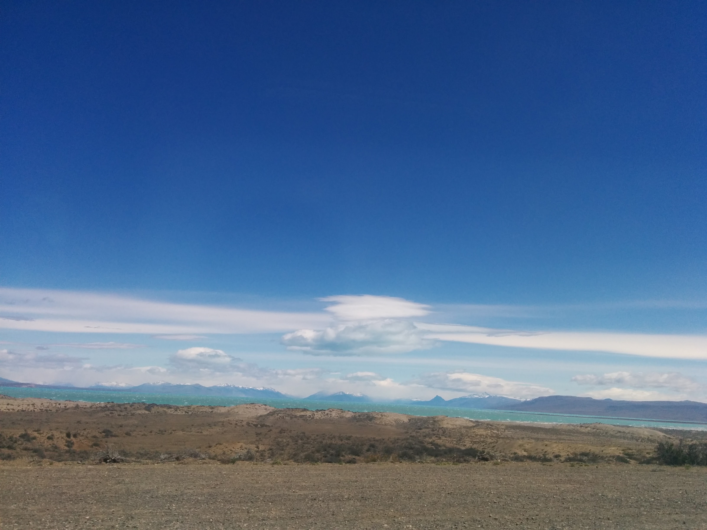
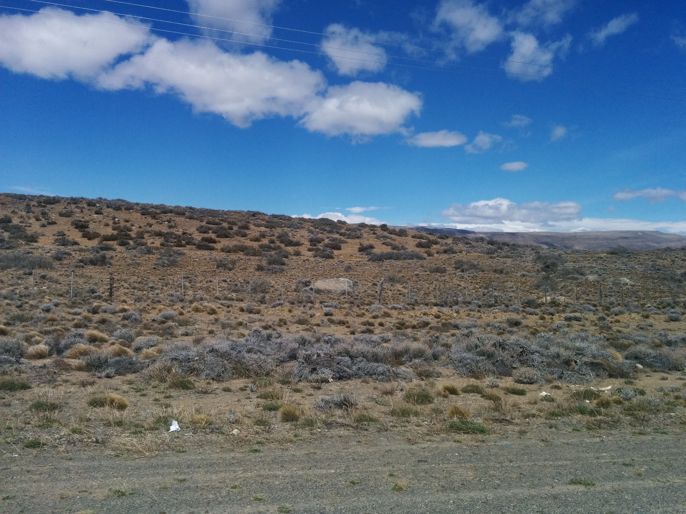

Aterrissage à El Calafate à 11h : à l'arrivée, nous avons pris notre ticket à l'un des comptoirs de bus et navettes, car notre destination du jour, c'est El Chaltén, la capitale du trekking. On change de paysage, on change de climat ! Adieu short, bonjour polaire.

> Attention, à El Chaltén, très peu d'établissements acceptent la carte bleue. Pensez à retirer suffisamment de cash (n'oubliez pas les limitations des distributeurs). Il y a un seul ATM/cajero automático à El Chaltén et il peut vite être pris d'assaut.

## La Patagonie !

J'attendais ce moment comme un enfant attend Noël. Le minibus que nous avons pris nous a emmenés à travers un no man's land de collines de terre sèche ("la stepa") jonchées de petites boules d'herbe rase. Au loin, les montagnes s'étirent dans des nuances de bleu et de violet. Quelques nuages dans le ciel mais 8° au thermomètre et des rafales de vent, composante classique du climat en Patagonie. Et puis on a vu les pics enneigés se rapprocher.

<!--more-->

Le trajet au milieu de ces collines désertiques teintées d'ocre, de vert sombre et de gris, dure presque 5h. La route contourne le Lago Argentino, lac aux mille nuances de turquoise. On nous expliquera plus tard que ce sont les sédiments en suspension qui lui donnent cet air de plage paradisiaque. À mi-chemin, le conducteur s'est arrêté à l'unique commerce de la région, qui fait à la fois office de café, hotel et boutique de souvenirs. C'était pour nous l'occasion de prendre un snack (une empanada ou une part de pizza) car nous n'avions pas encore déjeuné. Dehors, un panneau indique les distances des grandes villes du monde. Le chauffeur qui prenait l'air dehors, a pointé du doigt un buisson et nous a raconté que les baies qui y poussent ont donné leur nom à la ville : El Calafate c'est une ville de Patagonie, mais c'est aussi un fruit rouge très apprécié dans la région (en confiture, en parfum de glace…). El Chaltén est un village organisé autour du tourisme de randonnées, un peu comme le parc Astérix : mignon, petit, mais très efficace. Le minibus nous a déposé devant notre auberge. À l'accueil, l'employé nous a fait le topo des adresses où manger, où boire selon notre budget ; il nous a expliqué les différents chemins qu'il est possible de prendre pour notre trek le lendemain. Plein de bons conseils qui ont été les bienvenus ! Dans le hall de l'auberge, nous avons rencontré Camille et Martha, une française et une italienne avec qui nous ferons la rando. Notre chambre est confortable et au calme mais le wifi est tout pourri.

 

## En route vers le Fitz Roy

J'avais passé des heures à écumer les internets au sujet des sentiers à faire depuis El Chaltén. Je voulais un truc fou, mais qui reste accessible à Madame et Monsieur tout-le-monde, sans nécessairement prendre de guide. J'ai lu mille fois que les sentiers sont très bien balisés, alors nous avons opté pour une journée de trekking qui a commencé à l'Hostería El Pilar (plus au nord) où nous avons été déposés par une navette, le matin. Ce Sendero de la Laguna de los Très longe le Rio Blanco, un ruisseau d'eau claire qui coule directement de la montagne et où on peut remplir nos petites bouteilles tout au long du sentier. Tous les quarts d'heure de marche, le paysage et la végétation changeaient. Sur le chemin, plusieurs miradors dévoilent le Cerro Torre et le Fitz Roy (souvent cachés derrière un anneau de nuages) ainsi que des glaciers. Sur les 6 premiers kilomètres, pas de difficulté particulière, c'est par la suite que les choses se sont corsées : au niveau du camping Poincenot, nous avons le choix entre continuer notre chemin vers le sud, qui mène jusqu'au village, ou bien prendre la montée jusqu'à la Laguna des Los Tres, au pied du Fitz Roy. Ce chemin-là est rocailleux et très escarpé (sportif mais pas dangereux).

Je n'ai pas pu m'empêcher de repenser à [ce dessin de Pénélope Bagieu](http://www.penelope-jolicoeur.com/2012/03/largentine-4-el-chalten.html) qui fait référence au Mordor. (Pénélope, si un jour tu lis ces mots, **merci** de m'avoir fait rêver du Fitz Roy <3).

> Pénélope Bagieu - Fitz Roy

Nous avons croisé beaucoup de marcheurs sur toute la montée. Près du 7e kilomètre, un français qui descendait nous a dit "courage, vous êtes à la moitié la montée. HAHAHA ! Non c'est pas vrai." Enfin arrivés, on découvre le lac caché derrière la côte, juste au pied du Fitz Roy. La Laguna de los Tres. C'est de toute beauuuté ! On est resté là un moment à profiter du spectacle. La suite du parcours consiste à reprendre la même pente dans l'autre sens, en descente ; et au niveau du camping Poincenot, reprendre le sentier pour rentrer. On est arrivés à l'auberge à 20h30 - soit dix heures de rando - complètement cuits !

Ma petite victoire du jour : ZÉRO AMPOULE aux pieds ! Mes chaussures de rando Merrell sont de vraies pantoufles.

### Au compteur

- 42
    
    heures de bus
    
- 1
    
    tour en bateau
    
- 30
    
    km de marche
    
- 4
    
    heures d'avion
    

## Retrouvez tous les articles concernant notre voyage en Argentine

- [Voyage en Argentine : prologue](https://blog.cissou.me/2017/05/voyage-en-argentine-prologue/ "Voyage en Argentine : infos et astuces")
- [Iguaçu, les chutes du côté Brésilien](https://blog.cissou.me/2017/07/buenos-aires-iguacu/ "Iguaçu, les chutes du côté Brésilien")
- [Iguaçu, les chutes du côté Argentin](https://blog.cissou.me/2017/07/les-chutes-diguazu-cote-argentin/ "Iguazú, les chutes du côté Argentin")
- [El Chaltén et le Fitz Roy](https://blog.cissou.me/2017/08/el-chalten/ "El Chaltén et le Fitz Roy")
