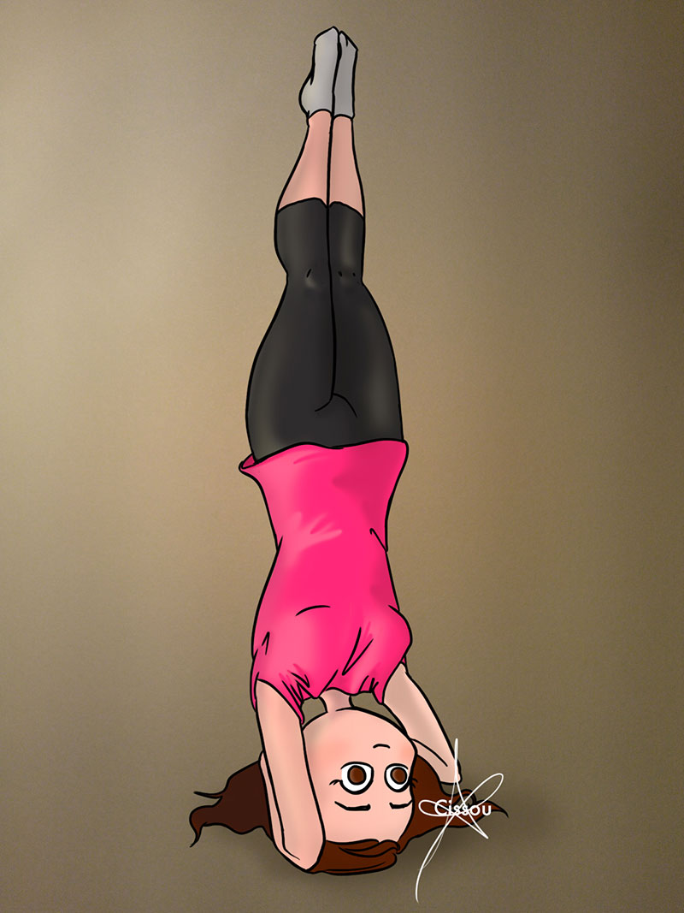

Je consacre mon premier dessin de l'année à mes progrès récents au yoga. Tenir en équilibre sur la tête et les avant-bras (headstand pose) sans appui de secours (sans mur) derrière moi est ma dernière petite fierté. Un peu de travail, de la régularité et de la confiance en soi pour atteindre ses objectifs, true story.

