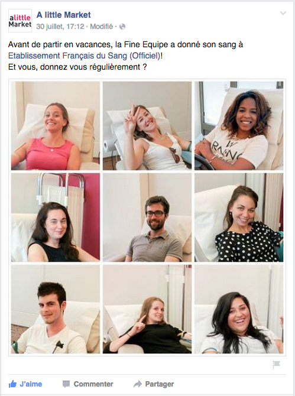

## Et si vous preniez le temps de... Sauver quelqu'un ?

J'avais posté [ici une gribouille au sujet du don du sang](https://blog.cissou.me/2013/05/downey-dos-nez-donnez/). Il y a 4 ans, j'ai rassemblé tout mon courage et je me suis rendue à l'EFS pour faire mon premier don. Je me posais tout un t'as de questions, dont "est-ce que ça fait mal ?" ou "est-ce que j'en suis capable ?" Le meilleur moyen d'en avoir le coeur, c'était d'essayer. Comment ça se passe ? 

<!--more-->

### Les critères l'éligibilité au don

\- Avoir entre 18 et 70 ans - Peser au minimum 50Kg - Ne pas être anémié, diabétique, épileptique ou sujet à des problèmes cardio-vasculaires - Ne pas être enceinte - Ne pas avoir contracté de virus transmissible par le sang (VIH, Syphilis, hépatites virales B et C)

Il y a notamment des délais à respecter comme : - 4 mois après la pose d'un tatouage ou d'un piercing - 4 mois après le retour d’un voyage dans un pays impaludé - 4 mois après un séjour dans un pays où le paludisme est présent - 14 jours après un traitement (antibiotiques, corticoïdes en comprimés...) - 7 jours après un détartrage - 1 jour après le traitement d'une carie Pour en savoir plus, visitez [le site de l'EFS](http://www.dondusang.net/rewrite/article/2436/dons-de-sang/les-contre-indications-au-don-de-sang/don-de-sang:pourquoi-des-contre-indications-existent.htm?idRubrique=980)

## Don du sang total

### Avant le don : le questionnaire

Un don de sang total se fait généralement sans rendez-vous. On vous fait tout d'abord remplir un questionnaire double page pour établir plus rapidement votre éligibilité au don. Ce questionnaire rassemble les situations à risque, soit pour le donneur, soit pour le patient : il permet au médecin d'identifier en amont les points bloquants s'il y en a et évite ainsi au donneur de perdre du temps au labo ; le médecin s'appuie aussi sur ce questionnaire pour s'assurer que le donneur se sent en forme et réduire les risques de faire un malaise pendant le prélèvement ; il prendra systématiquement votre tension.

### Avant le don : les vérifications

Une fois passé au labo, si c'est votre premier don, on va tester, d'un petit pic sur le doigt, votre taux d'hémoglobines, vérifier que vous n'êtes pas anémiés : il faut avoir au minimum de **12g/L** , sinon la législation ne leur permet pas de faire le prélèvement, même si vous vous sentez en forme.

Confortablement installé sur le fauteuil, on va vous demander de confirmer votre identité pour éviter tout mélange dans les dossiers des donneurs. Vous pourrez choisir le bras sur lequel le prélèvement sera fait. Les infirmières sont vraiment aux petits soins !

### Pendant le don

Le prélèvement de sang total dure **en moyenne 10 minutes**. Au moindre signe de malaise ("tout d'un coup j'ai chaud ", "j'ai la tête qui tourne", " je me sens bizarre "...) elles font le nécessaire pour que tout se passe bien et que le malaise se fasse oublier : inclinaison du siège, brumisateur, surveillance.

Une fois le pansement fait, on vous informe sur les choses à éviter dans les heures qui suivent le don, pour éviter tout risque de malaise. On vous demande d'être plus vigilant concernant votre santé pendant 15j. Non pas parce qu'on craint ce que vous pourriez avoir attrapé pendant le don, mais plutôt ce qui n'aurait pas être détecté et que vous pourriez transmettre par le sang au malade. On vous donne un numéro à avertir au moindre signe d'infection. Ensuite on vous envoie à l'espace collation pour manger et surtout boire.

Finalement, ça se passe assez vite et le personnel est vraiment accueillant.

## Et le don de plaquettes ?

J'avais fait un premier don de sang total et tout s'était bien passé, alors quand on m'a dit "vous avez beaucoup de plaquettes, vous avez pensé au don par [aphérèse](https://fr.wikipedia.org/wiki/Aph%C3%A9r%C3%A8se_\(m%C3%A9decine\)) ? Ce serait vraiment profitable pour les malades, réfléchissez-y si vous comptez revenir et si vous avez du temps".

### Comment ça se passe ?

Dans l'ensemble, le processus est le même que pour un don total. La différence principale, c'est la durée du prélèvement : le don de plaquettes (en réalité plaquettes+plasma) se fait en 1h30. Cette technique vous permet de conserver vos globules rouges (cellules qui permettent, entre autres, de transporter l'oxygène). Cela rend ce type de don moins fatigant.

Lors du prélèvement, le tube qui transporte le sang n'est pas directement lié à une poche comme pour le don total : il est raccordé à une machine qui sépare les composants du sang et ne stocke en poche que les plaquettes et le plasma. Le reste (sauf une partie du calcium) est restitué : la machine alterne des cycles de prélèvement et de retour de sang (toutes les 2-3 minutes).

[Retrouvez plus d'informations sur le don par aphérèse ici](http://www.dondusang.net/content/medias/media1838_DfNatehzCHxXjer.pdf?finalFileName=Document_dinformation_pre.pdf).

### Pourquoi "sauf une partie du calcium" ?

Ça fait partie du procédé de séparation des composants : le citrate, substance utilisée pour éviter la coagulation du sang dans le circuit au cours du prélèvement, fait chuter le taux de calcium dans le sang.

### Est-ce que je vais faire des carences en calcium ?

Non, c'est temporaire. Lorsque l'absence de calcium dans le sang se fait sentir (les symptômes sont divers, pour moi : des fourmillements et vibrations assez forts dans les joues et les lèvres. Bref, rien de bien grave) il suffit de le signaler à une infirmière ou au médecin et le contenu d'une petite ampoule de calcium vous sera versé sous la langue ; en quelques minutes tout rentre dans l'ordre ! Une fois le prélèvement terminé lorsqu'on vous fera passer à l'espace restauration, les symptômes seront déjà oubliés.

### 1h30, c'est long !

C'est le temps nécessaire à la machine pour extraire jusqu'à 8 unités de plaquettes (soit assez pour **un seul** malade) avec des cycles de prélèvement-retour. Pour passer le temps, l'EFS met à disposition des donneurs des lecteurs DVD et propose un large choix de films et de series. Un iPad connecté en Wi-Fi est disponible sur chaque fauteuil et on propose aussi un grand nombre de livres. Vous pouvez sans problème avoir votre téléphone portable avec vous et apporter votre lecture. Le reste de vos affaires sera dans un casier fermé et c'est vous qui en gardez la clé.

## Comment le sang prélevé est-il utilisé ?

Je vous invite à regarder cette [courte vidéo YouTube](http://www.youtube.com/watch?v=BHtCRw4oegg&sns=em "Comment le sang est-il utilisé ?") qui explique très simplement à qui et à quoi sert chaque type de don.

Maintenant, vous savez (presque) tout, alors vous aussi devenez un héros du quotidien ! Vous n'avez plus qu'à rassembler votre courage et donner un peu de votre temps :)

**Big Up** aux collègues d'Etsy France - AlittleMarket (et aussi Skyrock) qui ont participé à la collecte avec le sourire !

