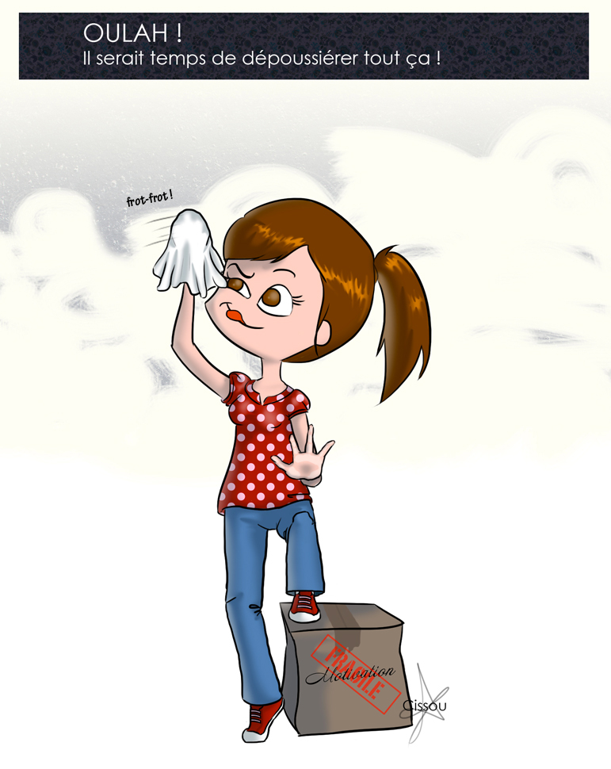

Premier post de 2011 (mieux vaut tard que jamais !) : un nom de domaine tout neuf, un design tout neuf, et un wordpress à jour (c'est pas trop tôt !)

Et je saute sur l'occasion pour vous annoncer que je participerai à la [Japan Expo](http://www.japan-expo.com/ "Japan expo") (qui a lieu en même temps et au même endroit que le [Comic Con](http://www.comic-con-france.com/fr/ "Comic Con")) les samedi 2 et dimanche 3 juillet 2011. Je serai aux côtés deux talentueuses illustratrices au stand "Les Petites Grandes". Notre blog commun sera bientôt en place.

Prochainement chez Cissou : des mariés, des dessins pour la Japan Expo et si vous êtes sages, des blagounettes.

Allons-y, Alonso !
