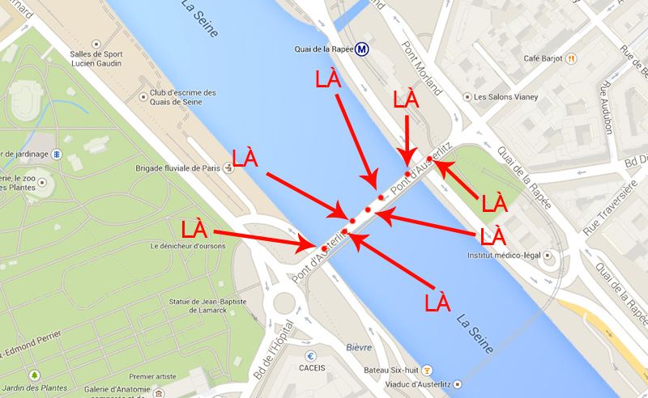
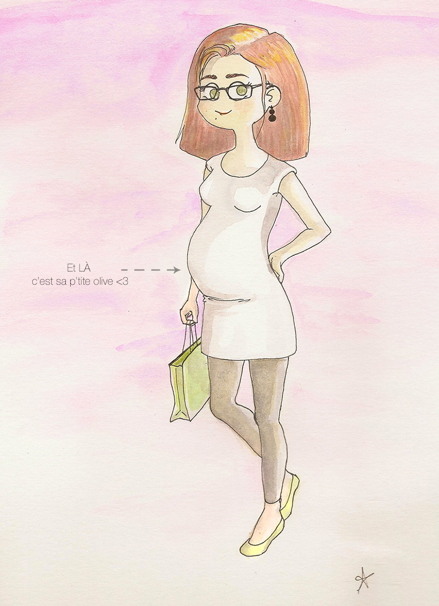

Pour Marie, j'ai chanté J'ai chanté "Julie la p'tite olive" Je l'ai chantée en accéléré Je l'ai chantée la nuit, alors qu'on traversait un pont à pieds. Où exactement  ?

### Marie c'est ma Tête d'ail :)

 

Vous ne connaissez pas "Julie la p'tite olive" ? Plus pour longtemps.

<iframe src="//www.youtube.com/embed/Vg46agliD4w" height="315" width="560" allowfullscreen frameborder="0"></iframe>
