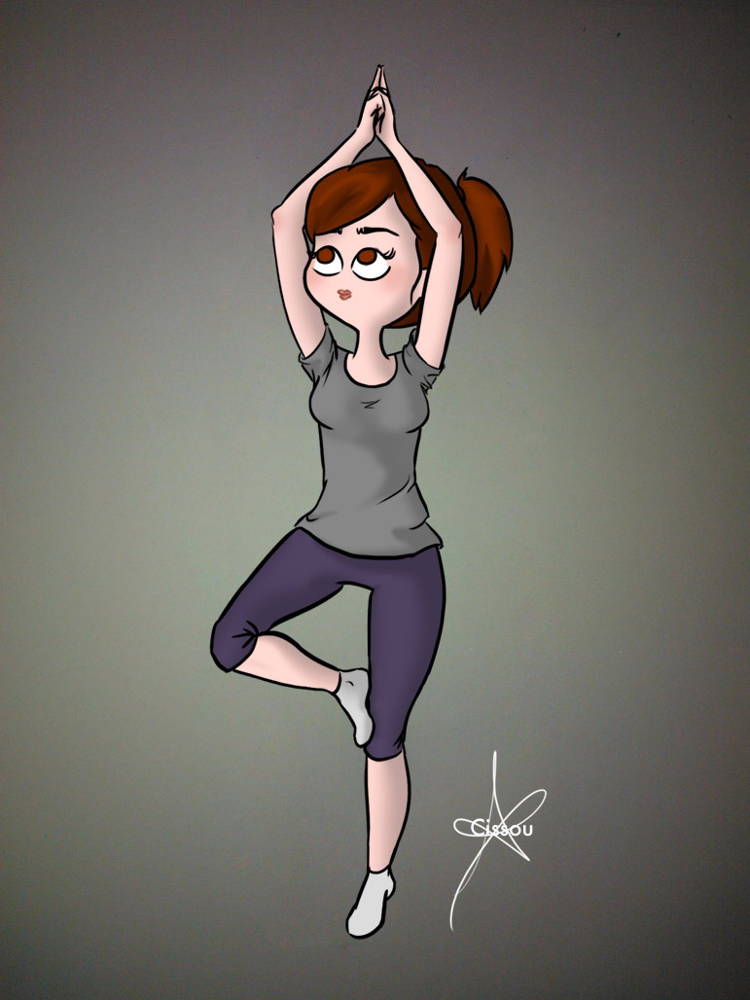

Bonjour !

Ce petit post a pour but d'expliquer que je dessine beaucoup moins souvent parce que je fais plein d'autres choses. _Un peu_ de sport, un peu de photo, _un peu_ de papercraft, _un peu_ de DIY, _un peu_ de cuisine, etc. Avec _un peu_ de motivation, j'ajouterai peut-être des catégories à ce blog pour poster autre chose que des dessins. We'll see ! 

La posture de l'arbre (honnêtement, j'ai du mal à rester en équilibre)"
