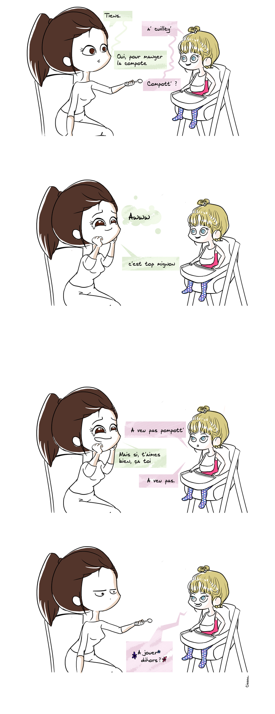

Bonjour les gens ! (s'il y en a qui viennent encore par ici) Loin de la série des Trumuch, voici un petit post en deux parties, suite aux conseils de ma pôtite môman.  Il s'agit surtout de la phase "apprendre à être tata, face à une petite chipie". Histoire à suivre. Bientôt. Normalement.
