Un séjour à Lisbonne, suite et fin : au programme, beaucoup de marche dans les rues colorées, très pentues et pavées de la ville.

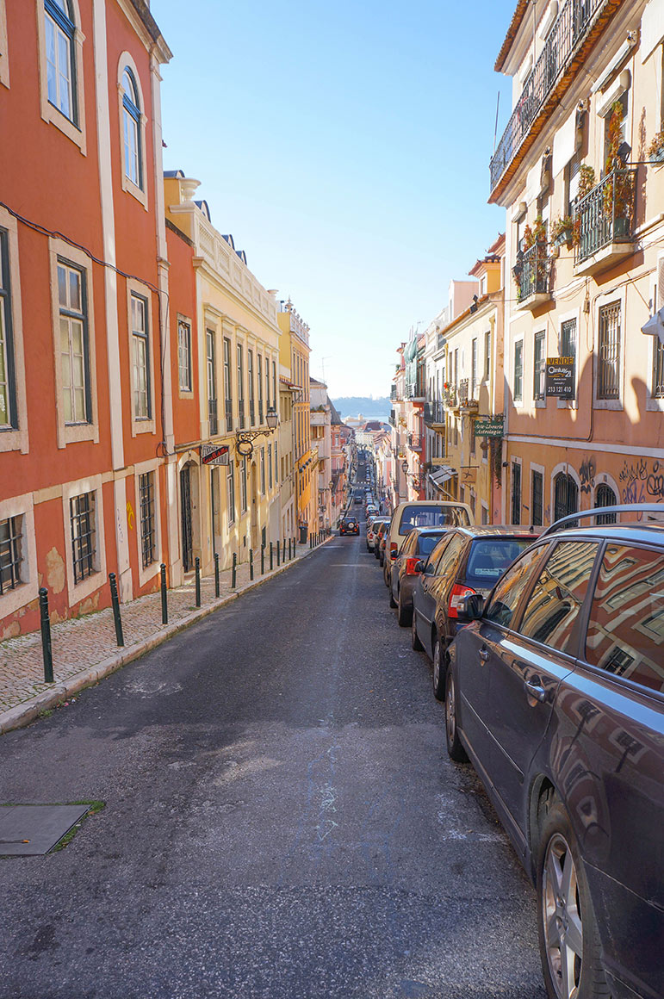

Le portail d'entrée du Jardin Botanique :

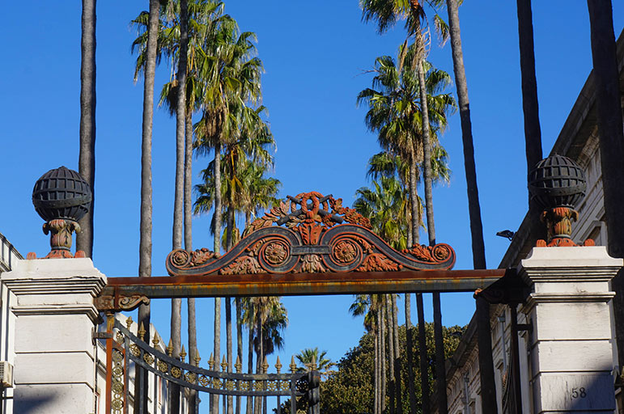colorée")

Une devanture de boutique pour le moins originale : 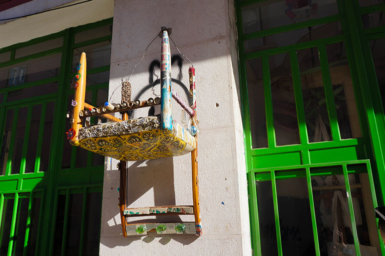

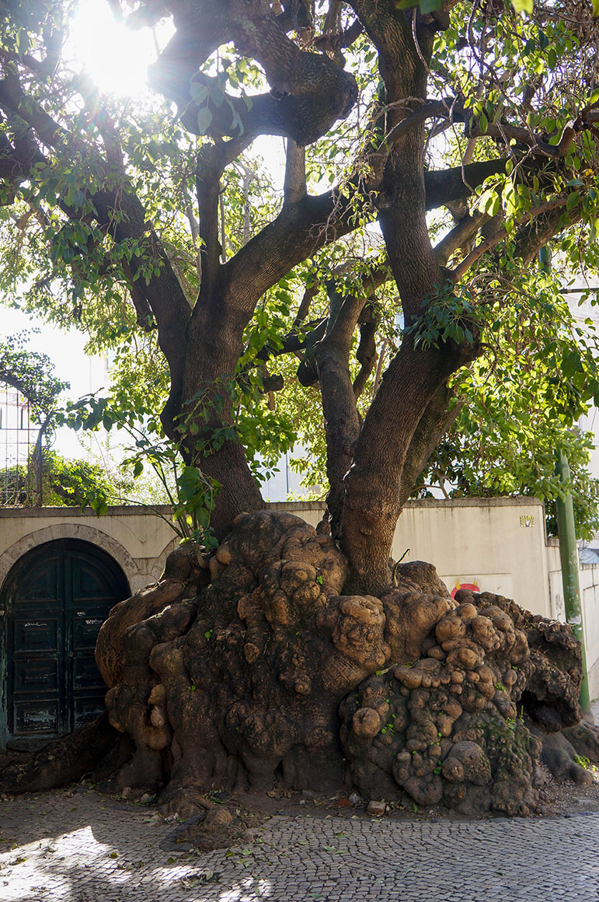

Les fameux foulards chamarrés folkloriques, aux fenêtres d'une grande rue commerçante du centre :

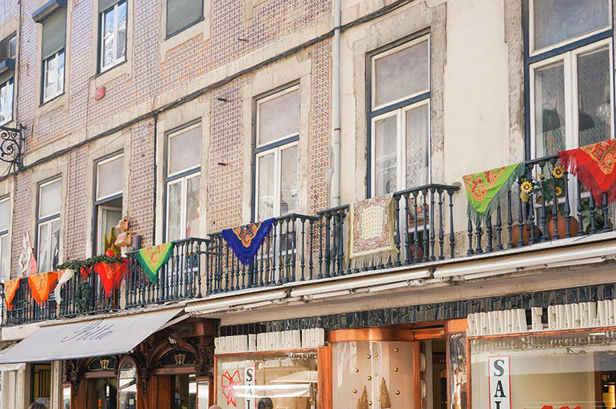

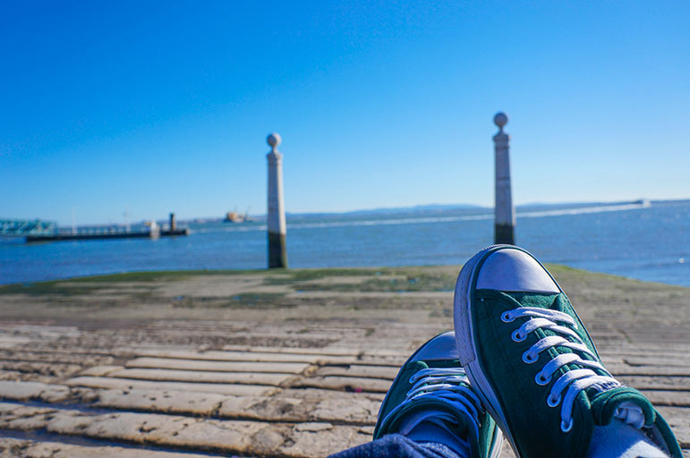

Puis direction l'ouest de la ville avec le Jardim Afonso de Albuquerque

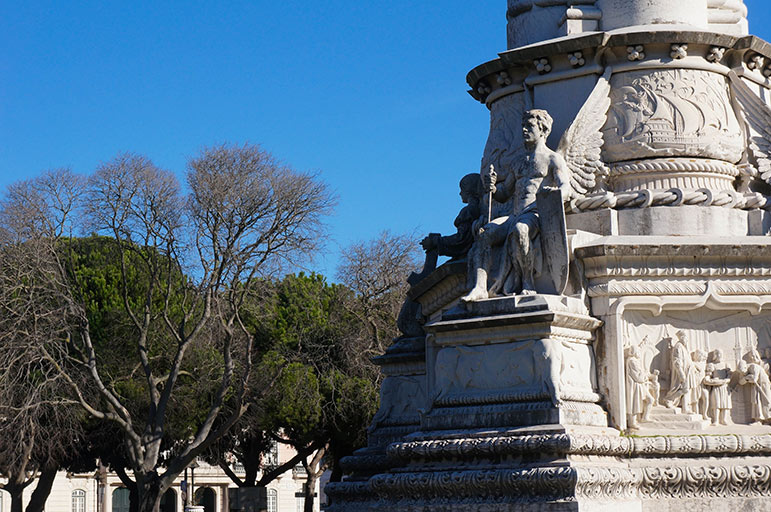

Suivi du Mosteiro dos Jerónimos

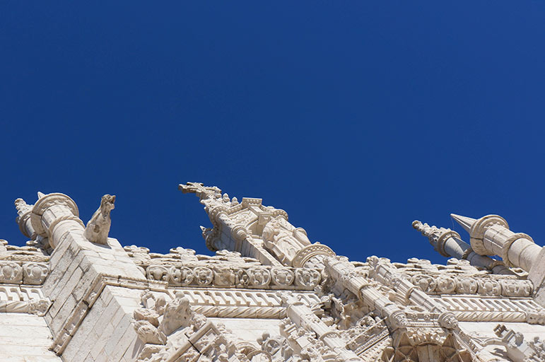

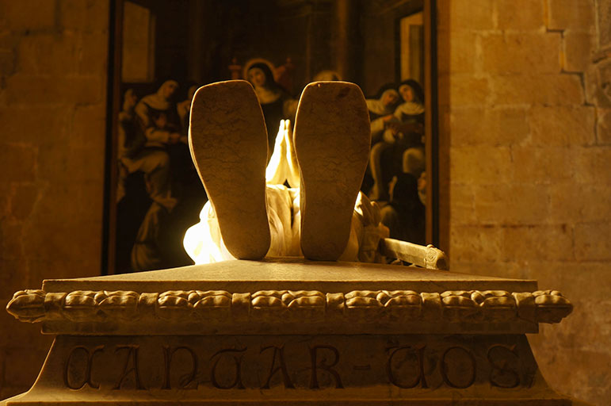

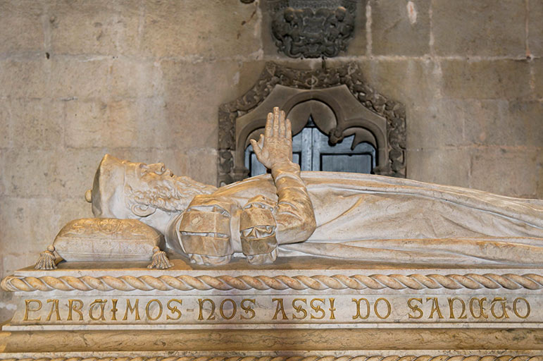

Et enfin, la tour de Belém (derrière sa maquette)

")

")

Après toute cette marche, nous avions bien mérité de goûter aux fameux [Pasteis de Belém](http://www.pasteisdebelem.pt/ "Pasteis de Nata de Belém") ! Un régal <3

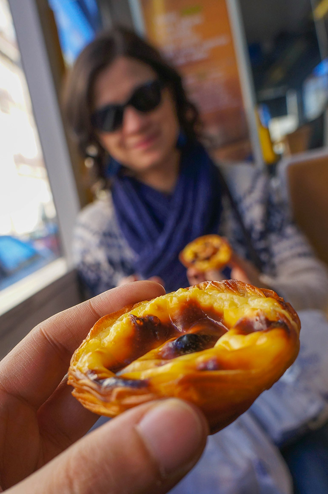

 

La visite se poursuit en banlieue nord-ouest de la ville, où se situe l'Oceanarium

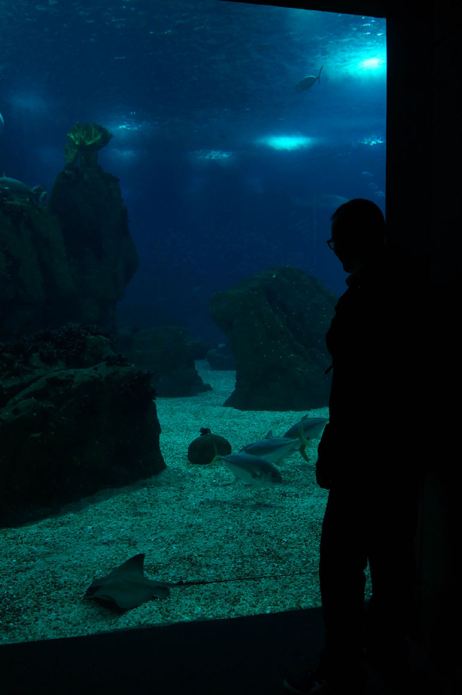

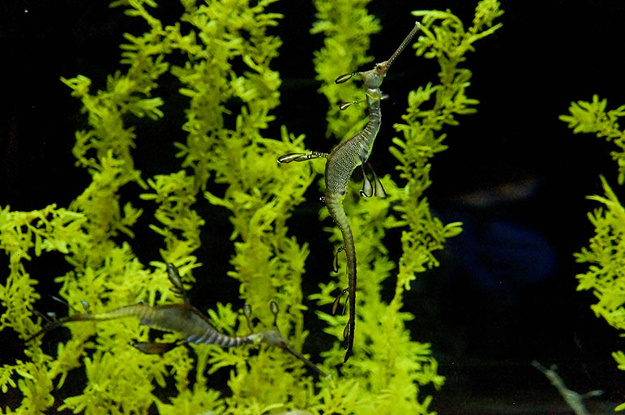

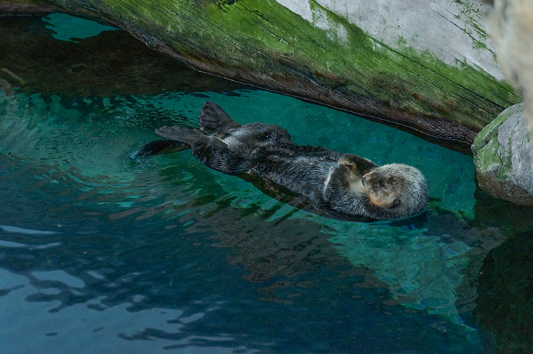

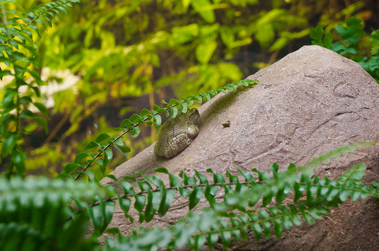

C'est terminé ! J'espère que toutes ces couleurs vous ont donné envie d'y aller !
