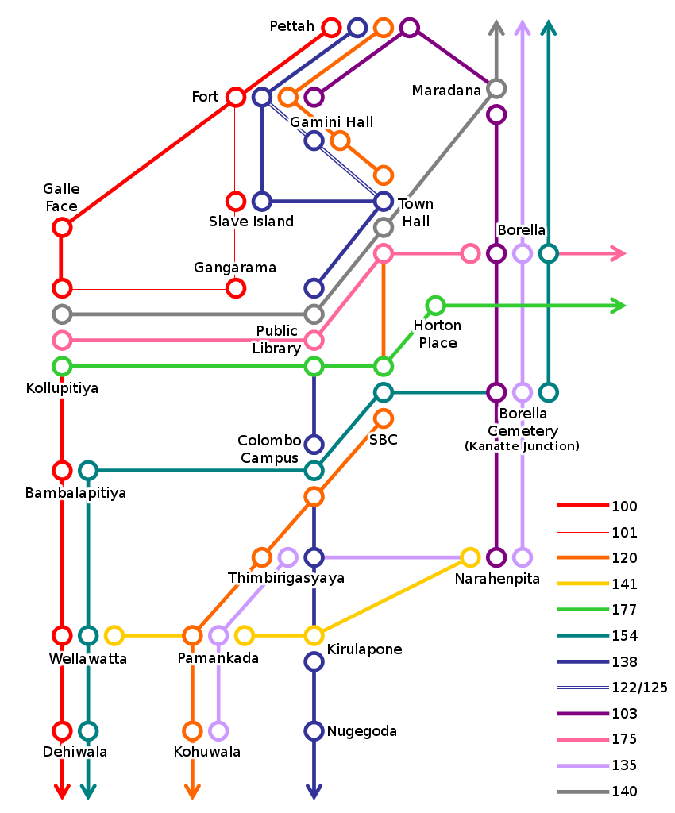

Depuis les montagnes, pour rejoindre Mirissa, nous prenons un bus de bon matin en direction de Bandarawella, où une centrale de bus propose d'avantage de correspondances. Pour vous donner une idée du type de trajet qu'on rencontre dans les montagnes du Sri Lanka, sachez que le bus pour Bandarawella dispose de stocks de sacs-à-vomi en libre service, suspendus côté fenêtres. Les suites de virages en tête d'épingle, vous connaissez sûrement, mais vous êtes certainement moins accoutumés à la conduite sri-lankaise.

<!--more-->

Là-bas nous changeons donc pour un bus en direction de Matara. La route sera longue, le bus plein, mais au fur et à mesure qu'on s'approchera des côtes du sud, la météo redeviendra de plus en plus estivale. Une fois arrivés à Matara, le plus dur est fait, en fin d'après midi il ne reste plus que quelques kilomètres que l'on a le choix de parcourir en tuk-tuk ou alors en bus pour une vingtaine de roupies, puis à rejoindre l'hôtel. Trois nuitées de repos et de bronzette en perspective. L'accueil de [l'hotel Esprit d'Ici](http://espritdicihotel.com/ "Esprit d'Ici hotel") est chaleureux, nous avons été reçus comme des membres de la famille. Les responsables et le personnels sont attentionnés et de bons conseils.

Nos craintes concernant la météo à cause de la période de mousson sont vite estompés : malgré la couche nuageuse, il fait chaud, même après le coucher de soleil.

## Mirissa

La plage est bordée de bars-paillotes plus ou moins grands, un peu comme on en voit dans les îles. La journée, ils servent des boissons, fournissent des transats et louent des bodyboards ; le soir ils disposent des bougies sur les tables et rangent les transats pour sortir l'étalage de poissons et crustacés péchés du jour. Ils seront cuisinés à la demande et facturés au poids, le tout dans une ambiance musicale lounge. La période de happy hour est plus longue qu'à notre habitude : 17h-00h, ce n'est pas pour nous déplaire. Les plages rassemblent pas mal de touristes (majoritairement) français. La journée, on y trouve aussi plusieurs points d'information concernant des cours de surf. La mer est un peu agitée, les vagues puissantes, c'est un spot idéal pour les débutants. Le soir, les crabes sortent se dégourdir les pattes sur le sable encore chaud. Alors que nous longeons le bord de mer pour nous installer et boire un verre, des centaines de petites pattes s'écartent avec précipitation à chacun de nos pas. Ces crabes-là sont couleur sable et à la lueur du soir qui tombe, nous ne les voyons qu'au moment où ils se mettent à bouger. Le sol grouille de toute part, c'est assez impressionnant et on finit par se demander si dans la confusion et la panique, certains ne vont pas grimper jusqu'à nos jambes.

Attablés à moins de cinq mètres de la mer, on entend le bruit des vagues, on observe les bateaux au loin et on savoure ces moments de détente autour d'un verre. Les prévisions météo annonçaient un lendemain nuageux et elles étaient juste, au moins concernant le matin : nous nous sommes baignés sans prendre de précautions particulière parce que le soleil ne cognait pas encore. Grossière erreur. Lorsque le ciel s'est dégagé aux alentours de midi, nous nous sommes enduits de crème solaire sans savoir qu'il était déjà trop tard. Nous avons voulu nous essayer au bodyboard pour une demi-heure et j'ai eu la bonne idée d'enfiler un t-shirt avant de retourner à l'eau ; ça a littéralement sauvé ma peau. Avec le courant qui nous fait dériver, le bodyboard s'est avéré épuisant, surtout quand on n'en a jamais fait auparavant. La pause déjeuner et le reste de l'après-midi se passeront à l'ombre sous la paillote. Smartphone, bouquin, tout est bon pour continuer à profiter de la plage sans brûler au soleil. De retour à l'hotel, Nipuni qui dirige [l'hotel](https://www.facebook.com/espritdicihotel "Esprit d'Ici hotel") avec sa famille, nous emmène sur le rooftop. Le 2ème étage et la terrasse sur le toit, au 3ème, sont encore en travaux. Elle nous raconte de l'avancement de la construction de l'hotel, ses projets d'aménagements pour le toit végétal, leur engagement pour faire travailler les locaux à la construction et à la fabrication de leur mobilier. Ce point de vue en hauteur sur la plage était l'occasion de faire quelques belles photos du soleil déclinant dans ce ciel nuageux. Le soir le constat est dans appel, la première baignade sans protection solaire a été meurtrière pour notre épiderme. Les projets de cours de surf pour le jour suivant sont annulés. Ce sera une journée à l'ombre : billard français, Karrom (billard indien), lecture, tri des photos, mise à jour du carnet de voyage, toute activité d'intérieur est la bienvenue. Nous profiterons de la piscine de l'hôtel lorsqu'elle sera à l'ombre, vers 17h. La soirée, elle, se passera comme les précédentes, autour d'une bougie, sur la plage, les pieds dans le sable, la musique lounge (ou parfois house) dans les oreilles, une boisson fraîche à la main. La cuisine du restaurant de l'hotel est délicieuse alors nous en avons profité pour commander des spécialités locales. Les hoppers, crêpes concaves avec un fond un peu épais comme un pancake, avec oeuf sur le plat et curry (de poulet et de poisson) : goûtu et très copieux ; le petit déjeuner traditionnel avec les string hoppers, petites galettes de nouilles de riz rouge accompagnées d'un curry, d'un dhal (lentilles rouges épicées et lait de coco) et d'un Pol Sambal (noix de coco rapée préparée avec du citron vert, du sel et beaucoup de piment) est vraiment très bon aussi.

Le troisième jour, il est temps de quitter les plages du sud pour rejoindre la capitale. Un bus nous emmène jusqu'à Matara, où nous nos rendons à la gare. La veille, nous avons réservé un billet de train pour Colombo dans une voiture 1 ère classe avec air conditionné. Quelques 3 ou 4 heures plus tard, nous arrivons en gare de Maradana, qui est l'une des gares de Colombo. Nous posons nos affaires à l'hôtel et nous partons dîner dans le quartier du Light House (phare, pour rappel : c'est une ville portuaire).

## Colombo

La dernière journée (complète) de vacance sera dédiée au shopping : lèche-vitrine et achats de souvenirs pour les proches. Par manque de temps, on n'a prévu aucune visite et comme les magasins que nous avons notés se trouvent aux quatre coins de la ville, c'est l'occasion de sortir le nez des bouquins et d'observer un peu les alentours. Le manque d'informations sur les transports en commun peut décourager de prendre le bus, néanmoins sachez que le coût de chaque trajet est dix fois inférieur à celui des tuk-tuks.

> Astuce : jetez donc un oeil à la carte ci-dessous, le réseau de bus peut vous emmener quasiment partout, l'unique difficulté reste de trouver le bon arrêt où attendre le vôtre.

_bus_routes)

Nous avons donc découvert le centre commercial Odel (qui ressemble à nos Galleries Lafayette), le magasin Laksalat qui vend des produits d'artisanat local, le Bazaar (qui n'est autre qu'un grand marché couvert comme les nôtres, on y trouve essentiellement des vêtements et accessoires) à côté duquel nous avons découvert le Telecom Monument ou encore le centre commercial Liberty Plaza (une perte de temps, honnêtement).

Nous nous sommes rendus à Galle Face Green en fin d'après-midi. C'est une longue place en front de mer où beaucoup d'habitants se retrouvent pour faire du cerf-volant et grignoter des snacks (locaux, bien entendu : beignets aux crevettes, brochettes de poulet, rotti/galettes, etc.) Beaucoup de monde s'y rassemble dans une ambiance musicale joyeuse et tranquille. Tous ces cerfs-volants le long de la plage sur fond de coucher de soleil, c'est une image qui m'a beaucoup marquée. C'était un moment tellement simple et à la fois magique !

Après le dîner dans le WIP du Old Dutch Hospital, nous retournons à l'hotel faire nos sacs pour la dernière fois. Pour rejoindre l'aéroport, il y a plusieurs possibilités : le tuk-tuk peut convenir mais le trajet est long et inconfortable, le bus est sujet à la densité du trafic, le taxi aussi (d'autant plus qu'il est cher) et enfin, le train. Nous nous sommes renseignés au guichet de la gare pour connaître les horaires et acheter nos tickets à l'avance.

> Astuce : De Colombo (la gare de Maradana pour nous) il existe une ligne qui rejoint Katunayake en environ 1h. C'est très bon marché (une trentaine de Rs par personne) et de là, il reste 1km à parcourir : soit en tuk-tuk, soit à pieds pour les plus courageux. Prévoir une marge de temps par rapport à l'heure d'embarquement : on parle de TRAINS, des retards sont possibles même si les trains sont fréquents.

Ces trains-là sont typiques : pas de portes, beaucoup de fréquentation et beaucoup de gens debout. Heureusement, au bout d'un quart d'heure, le train s'est pas mal vidé et nous avons pu nous asseoir et arriver sereins (et bien à l'avance) à l'aéroport. Des boutiques Odel et Laksalat se trouvent à l'intérieur de l'aéroport, après avoir enregistré les bagages. C'est l'un des moyens de passer le temps (avec "regarder les avions" et "manger").

Notre périple se termine ici, c'était fatigant mais qu'est-ce que c'était beau ! (Et qu'est-ce qu'on dort mal dans les avions...) Félicitations à ceux qui ont eu le courage de tout lire :D

Un merci tout particulier à Julien, sans qui ce voyage ne se serait jamais organisé !

        

## Retrouvez tous les articles concernant notre voyage au Sri-Lanka

- [Voyage au Sri Lanka : prologue](https://blog.cissou.me/2014/09/voyage-au-sri-lanka-prologue/ "Voyage au Sri Lanka : infos et astuces")
- [Negombo, Mihintale, Anuradhapura](https://blog.cissou.me/2014/09/negombo-mihintale-anuradhapura/ "Negombo, Mihintale, Anuradhapura")
- [Minneriya, Sigiriya, Dambulla](https://blog.cissou.me/2014/09/minneriya-sigiriya-dambulla/ "Minneriya, Sigiriya, Dambulla")
- [Kandy, Haputale, Dambatenne](https://blog.cissou.me/2014/09/kandy-haputale-dambatenne/ "Kandy, Haputale, Dambatenne")
- [Mirissa, Colombo](https://blog.cissou.me/2014/09/mirissa-colombo/ "Mirissa, Colombo")
- [Voyage au Sri Lanka : épilogue](https://blog.cissou.me/2014/10/voyage-au-sri-lanka-epilogue/ "Voyage au Sri Lanka : Les trucs qu'on retient")
