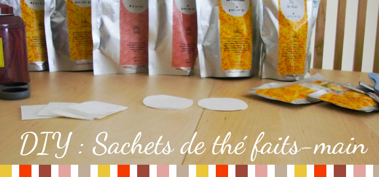
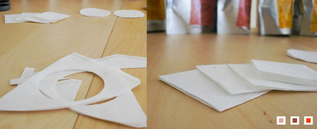
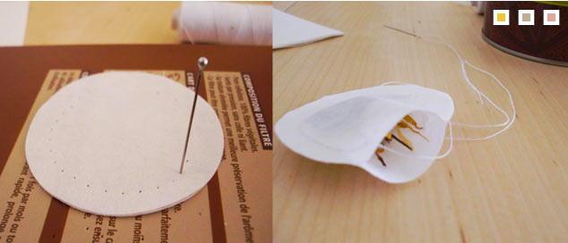
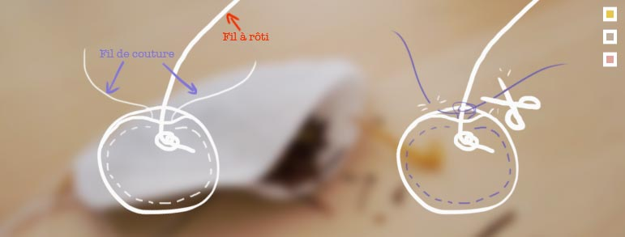
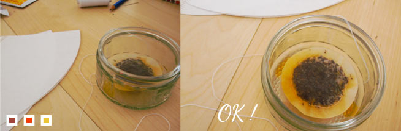
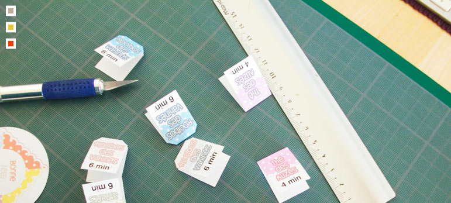
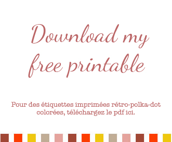
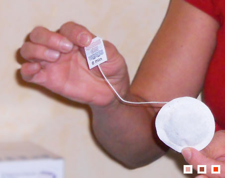
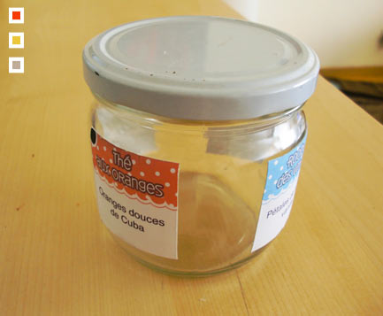

J'inaugure la nouvelle catégorie (DIY) avec un tuto girly : (attention, grande patience et dos solide required !) 

## Des filtres à café classiques + du thé (en pochette, en boîte) + du fil à rôti +

## une paire de ciseaux +une aiguille + du fil à coudre + une agrafeuse

1. On découpe des formes dans les filtres (j’ai choisi des ronds et des rectangles)
2. Pour éviter de se ruiner les doigts (et s’assurer un rendu régulier) on pré-perfore les filtres (deux par deux) puis on passe le fil et on coud le contour presque en entier.
3. On laisse un espace de la largeur d’une cuillère à café afin d’y insérer le thé, ainsi que le fil à rôti au bout duquel on a fait un noeud
4. On referme le sachet en prenant bien soint de nouer le fil à rôti avec le fil à couture et on répète l’opération avec les autres morceaux de filtres. 
5. (facultatif) On teste si le thé infuse facilement. Si ce n’est pas le cas, on effectue quelques trous dans le centre des sachets à l’aide d’une aiguille ou d’une épingle.
6. Pour les étiquettes, on découpe des rectangles de 2cm x 5cm qu’on pliera en deux. On y inscrit le type de thé et le temps d’infusion.
7. Afin que les étiquettes soient plus réalistes, couper les deux angles (au niveau du pli) avant de les agrafer au bout du fil des sachets
    
    ")
    

\[caption id="attachment\_576" align="aligncenter" width="453" caption="Et voilà le travail !"\]\[/caption\]

Il ne reste plus qu’à les stocker dans une jolie boite. j’ai choisi un pot en verre de hauteur moyenne et assez large.

Info : vous pouvez choisir d'utiliser un tissu fin à la place des filtres à café, comme des compresses stériles, ça infuse mieux mais c'est moins facile à manipuler pour la couture.
