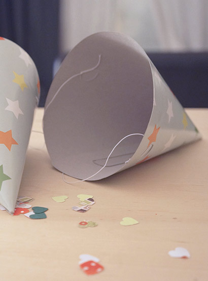
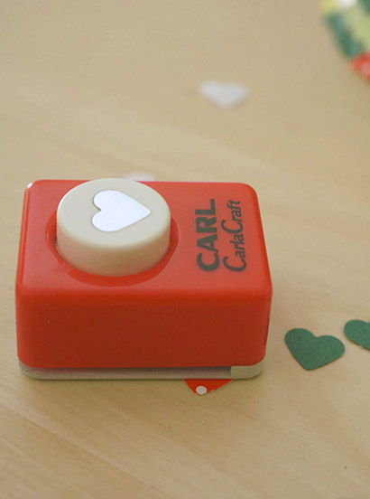
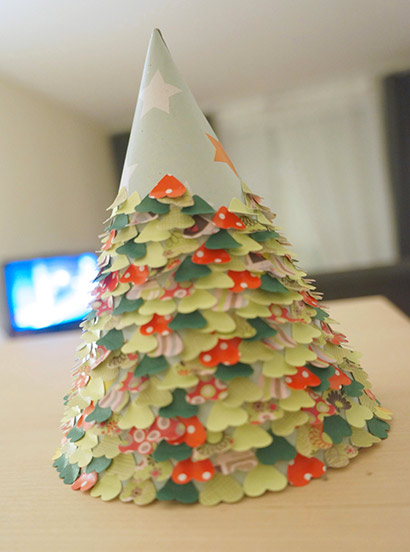
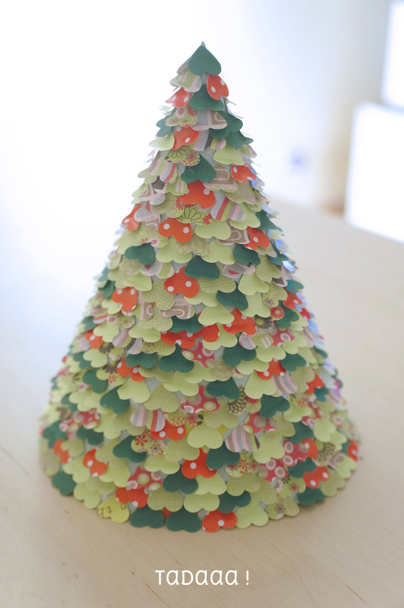
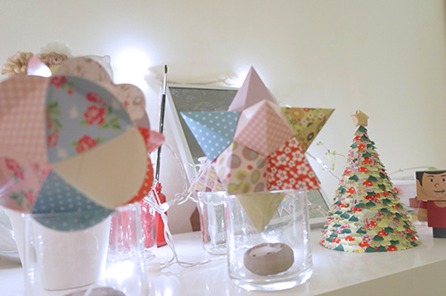

La période des fêtes approche à grand pas et chaque année, on n'ose pas "faire le sapin" parce qu'on a un chat fou. On a dû disposer nos plantes en hauteur pour s'assurer que le chat n'ira ni les déterrer, ni mâchouiller les feuilles, ni [les torturer](https://scontent-cdg2-1.xx.fbcdn.net/hphotos-xpa1/t31.0-8/1462729_10152026113064570_1462214779_o.jpg). Pour le sapin c'est le même souci, alors j'ai opté pour une alternative : j'ai réalisé **un sapin de Noël miniature en papier**.

Vous aussi, vous pouvez en faire un chez vous ! Voici comment procéder. <!--more-->

## Matériel

- Un chapeau de fête (en carton)
- Une perforatrice (ou un emporte-pièce) en forme de coeur
- Des feuilles de papier de couleur dans les teintes de vert et de rouge (unis ou à motifs)
- De la colle

- 
- 
- 

 

## Étapes

1\. Retirer l'élastique du chapeau pointu

2\. À l'aide de la perforatrice, découper beaucoup de petits coeurs.

3\. Recourber les coeurs-confétis entre vos doigts

4. Pivotez les coeurs (pointe vers le haut), déposez-y un peu de colle

5\. Fixez les coeurs un par un, tête en bas, sur le chapeau en carton en commençant par le bas

## Bonus : l'étoile

- Une feuille dorée
- Un cure-dents

1\. Découper une bandelette de 1,5cm de largeur et 20cm de longueur.

2\. Suivez les étapes de pliages indiquées [ici](https://fridaspeach.files.wordpress.com/2013/08/tumblr_moqrp0w1j41rj5xyqo1_1280.jpg "tutoriel pliage Lucky Star 1 ") ou encore [ici](http://www.lesmoineauxdelamariee.com/2013/01/les-moineaux-diy-origami-etoile-star.html#more "tutoriel pliage Lucky Star 1 ")

3\. Percer un petit trou en dessous de l'étoile obtenue et glisser le cure-dent et l'enfoncer dans la pointe en haut du sapin.

- 
- 

## Joyeuses fêtes !
