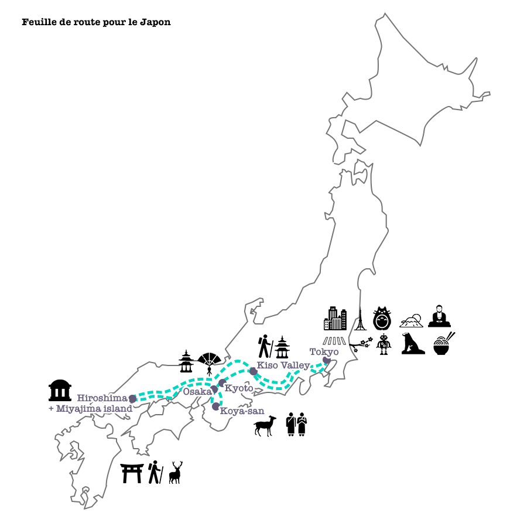
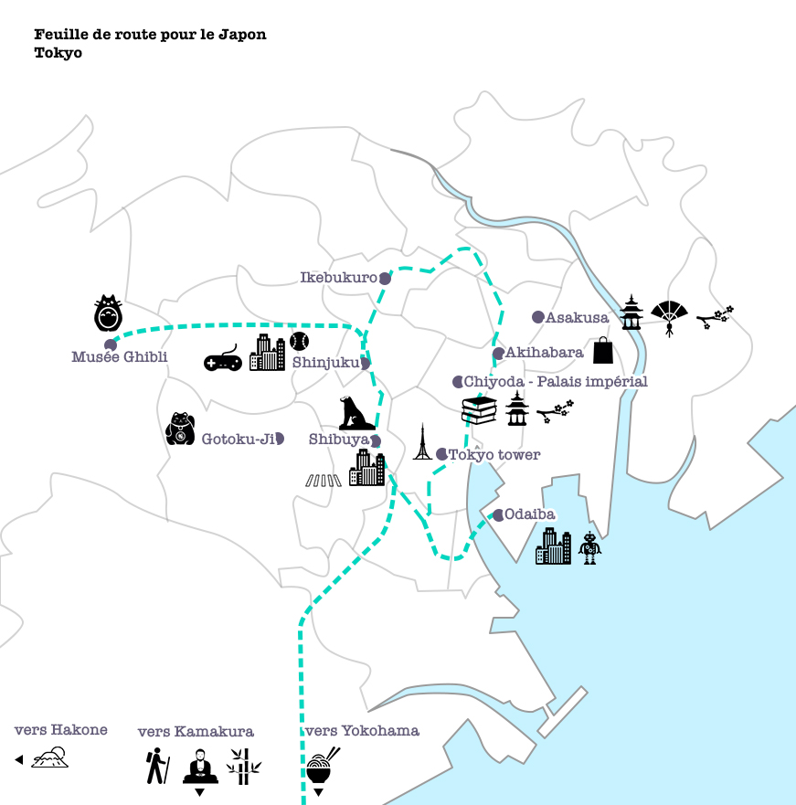
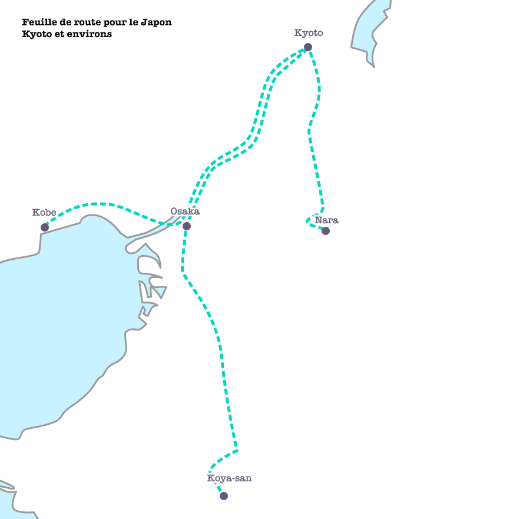
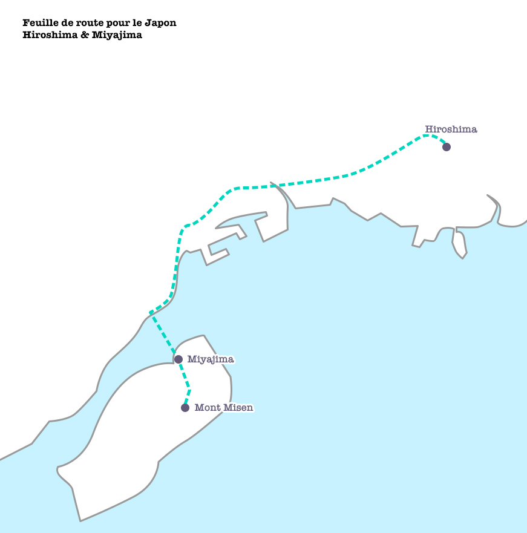

Ça faisait un moment qu'on en parlait et on a décidé de s'envoler au Japon un an à l'avance. Une année d'anticipation, à rêver de ce nouveau voyage ; en pleine période de "Japonismes" (pour célébrer le 160e anniversaire des relations diplomatiques entre le Japon et la France), on a été servis ! Multitude d'expositions, de reportages télé, de documentaires… Il ne nous restait plus qu'à déterminer notre itinéraire, choisir dans ce pays si grand entre ce qu'il ne faut pas manquer, et ce qui ne sera, en termes de logistique, pas réalisable dans ces trois semaines. Ce sera à voir _une prochaine fois_ (parce que oui, on pense déjà à la prochaine fois).

## La feuille de route définitive

Comme d'habitude, c'est avec un lonely planet sous le bras et beaucoup de temps passé sur les blogs de voyage que vous avons pu déterminer où aller, quoi faire, quoi voir. Nous essayons toujours d'alterner nos visites entre culture traditionnelle et culture moderne, et si de possible jongler entre l'activité de la vie urbaine, l'air frais de la montagne et le calme clapotement de la mer. Trois semaines, avec des distances assez longues, ça voulait forcément dire que pour profiter et voir un maximum de choses, le plus pratique était de rester sur l'île principale : Honshū, où nous avons choisi de nous focaliser sur **Tokyo**, **Kyoto**, **Koya**, **Osaka**, **la vallée Kiso**, **Hiroshima**, **Miyajima** et **Hakone**.

<!--more-->  

## Avant le départ

Pour notre préparation, nous sommes toujours des adeptes de [Wikitravel](http://wikitravel.org/en/Japan "Wikitravel"). [hyperdia](http://www.hyperdia.com/) est un site extrêmement pratique, qui fournit toutes les infos concernant les trajets ferrés (trains nationaux, régionaux et même métros des différentes compagnies). Tarifs, horaires, durée, numéro du quai de la correspondance, prise en charge du trajet en question par le JR Pass ou non, c'est une mine d'informations et nous étions tous les jours dessus, comme on le fait avec City Mapper en région parisienne. Les transports et les logements sont les sources de dépenses principales et après un petit calcul de la somme des trajets prévus, il nous est paru évident qu'il serait plus rentable (et beaucoup plus simple aussi) de prendre un [JR Pass](<http://JR pass>) avant le départ. Ce pass donne notamment accès au Tokyo Monorail (les navettes pour les aéroports Narita et Haneda + le métro de Tokyo), à l'ensemble du réseau JR qui parcourt l'île (sauf les Shinkansen Nozomi et Mizuho) et les bus JR locaux. Nous avons rapidement adopté la [Suica](https://www.kanpai.fr/voyage-japon/carte-suica), qui se charge aux bornes automatiques comme une [Oyster card](https://oyster.tfl.gov.uk/oyster/entry.do) et qui sert bien évidemment à voyager dans Tokyo via les différentes compagnies de métro non prises en charge par le JR Pass ; mais aussi qui sert de moyen de paiement, par exemple dans les Kombini. Il est possible de la dématérialiser en l'intégrant directement à votre téléphone - s'il a le NFC - via Apple Pay ou Google Pay si vous êtes des adeptes. Par ailleurs, autre info pratique bien sympa : pas de nouveau vaccin à faire, pas de visa à payer. Nous avons renseigné nos dates de voyages sur [Ariane](https://pastel.diplomatie.gouv.fr/fildariane/dyn/public/inscription/initEditionMesDonneesAuthentificationAjout.html;jsessionid=C16FB2ED93BAC9D8A2ABC8F38C51FE29.jvm01944-1?action=Ajout) et pris connaissances des [informations voyageurs](https://www.diplomatie.gouv.fr/fr/conseils-aux-voyageurs/conseils-par-pays-destination/japon/#entree) (comme les coordonnées du consulat de France à Tokyo, les activités sismiques, volcaniques et la météo du moment en pleine période de typhons). J'ai aussi pris soin de noter autant d'adresses de restaurants végétariens que possible dans chacune des villes de notre feuille de route.

Trois mois avant le départ, nous avons consacré du temps à l'apprentissage de la langue japonaise : Dhaya, en vrai passioné de la culture japonaise connaissait déjà quelques rudiments de la langue, alors il a surtout appris les [Katakana](https://fr.wikipedia.org/wiki/Katakana) (syllabaire pour les mots étrangers). Très pratique pour décrypter la plupart des étiquettes des plats à acheter dans les kombini ("oui-pu-ku-ri-mu" pour "whipped cream" par exemple). De mon côté, je me suis concentrée sur les formules de politesse (bonjour, enchantée, s'il vous plaît, merci, c'est très bon, excusez-moi) et le vocabulaire essentiel (la gauche et la droite, où sont les toilettes, je suis végétarienne/je ne mange pas de viande ni de poisson, les jours de la semaine, les mois, les heures, aujourd'hui, demain, etc.)
