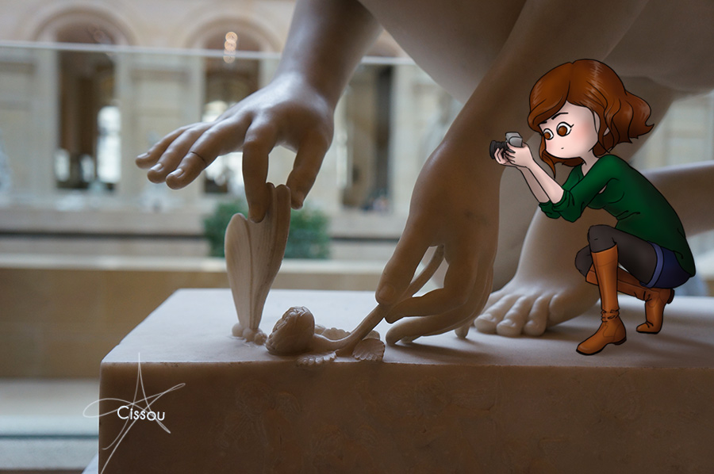
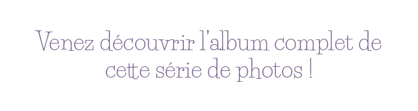
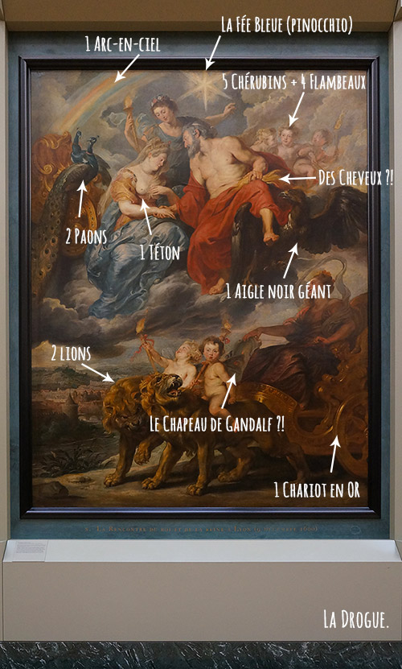

Il pleut, il fait froid, c'est le weekend mais on n'a pas pour autant envie de sortir se balader. Restez au chaud, faites une petite pause avec un bon thé et allez jeter un oeil à mon album dédié aux photos que j'ai prises au Louvre.   Bonus : parfois on tombe sur des oeuvres qui nous laissent perplexes... 
