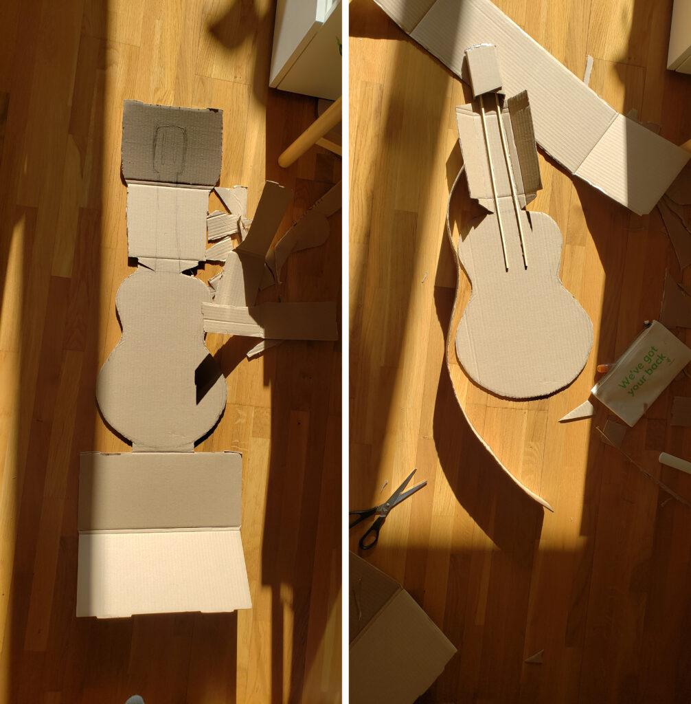
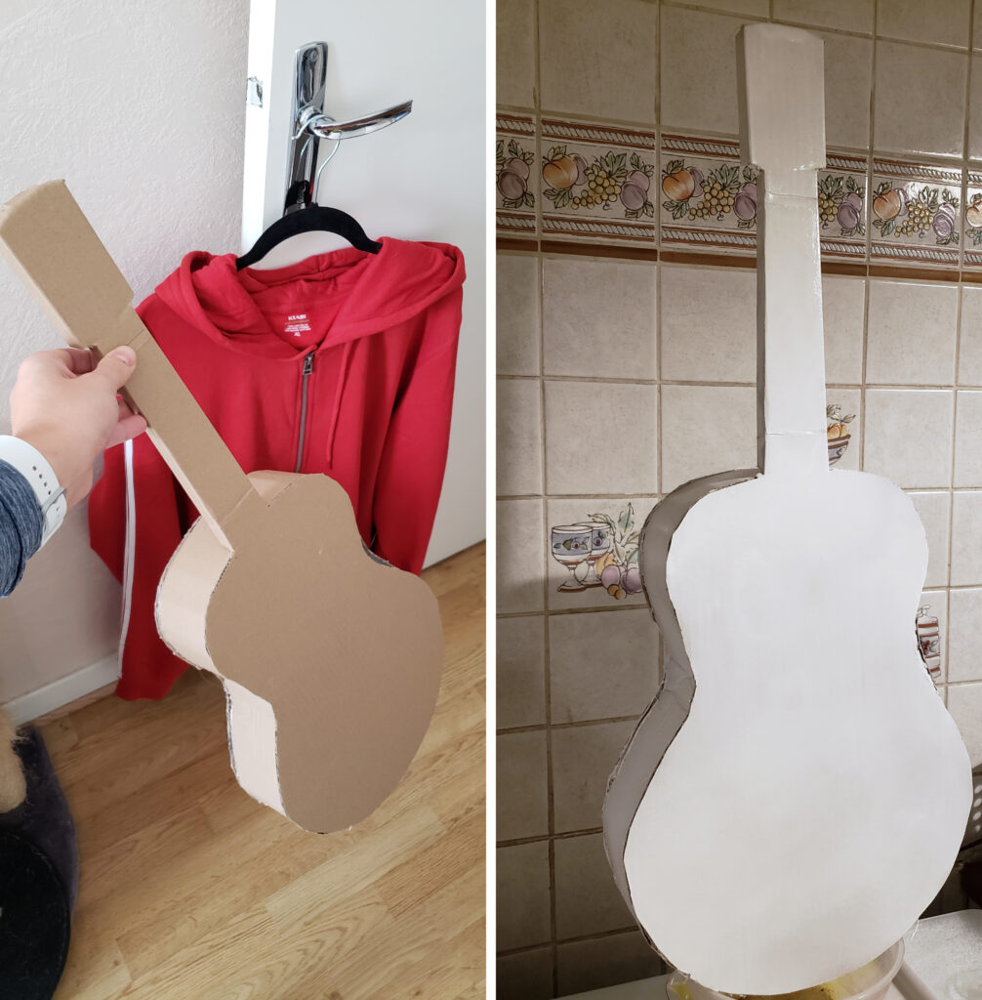
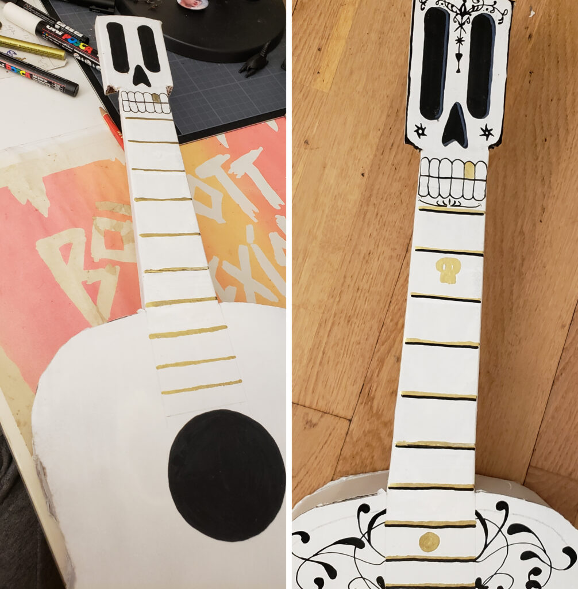
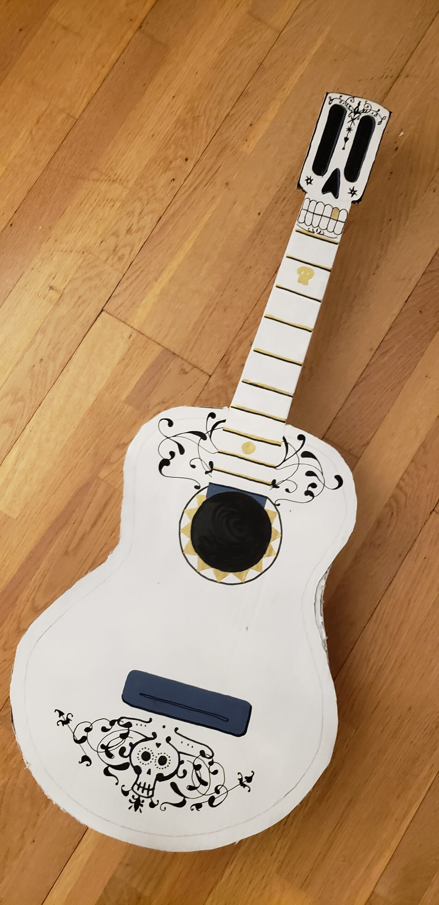
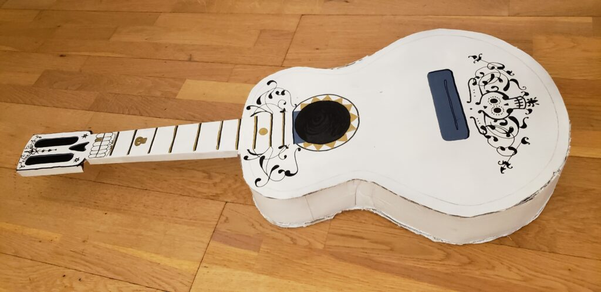

Cette année, à l'occasion d'une soirée Halloween, j'ai choisi de mettre à l'honneur mon film d'animation préféré : **Coco**. en m'habillant en Miguel, c'était l'occasion de se faire un déguisement "responsable" avec des vêtements que j'avais déjà (jeans, tshirt blanc, chaussures) où que je suis sûre de remettre régulièrement (hoodie rouge neuf). Je n'avais pas du tout envie de passer la soirée avec du maquillage noir&blanc sur le visage, alors j'ai préféré investir du temps dans la fabrication d'un accessoire indispensable à la tenue : la guitare d'Ernesto de la Cruz.

Mesdames et Messieurs, voici ma grande fierté de la semaine !

<figure>

<figcaption>

Création d'une guitare, étape 1 : dessin et découpe d'un grand carton

</figcaption>

</figure>

<figure>

<figcaption>

Création d'une guitare, étape 2 : assembler le tout et peindre en blanc

</figcaption>

</figure>

<figure>

<figcaption>

Création d'une guitare, étape 3 (ma préférée) : dessiner les détails au Posca noir et feutre doré

</figcaption>

</figure>

<figure>

<figcaption>

Ce n'est ni droit ni symétrique, elle n'est pas parfaite, mais qu'est-ce que je l'aime !

</figcaption>

</figure>

