Salut tout le monde ! J'en profite pour ouvrir une nouvelle catégorie dans laquelle je partage avec vous quelques uns de mes clichés. Le cimetière du Père Lachaise est vaste. Ce jour-là, j'en ai tout juste découvert un petite partie, peut-être bien un quart, au grand maximum.

\[caption id="attachment\_597" align="aligncenter" width="640" caption="Voici un tracé approximatif de ma visite"\][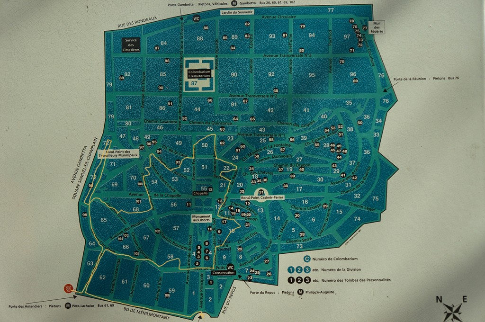](https://blog.cissou.me/wp-content/uploads/2013/05/plan.jpg)\[/caption\]

La principale raison, c'est qu'en ce tout premier dimanche chaud et ensoleillé de l'année, j'ai fuit les groupes de touristes. C'est pourquoi j'ai préféré les petits passages aux grandes allées et j'ai évité les divisions des célébrités les plus recherchées (Champolion, Chopin, Paul Eluard, Molière, etc.)

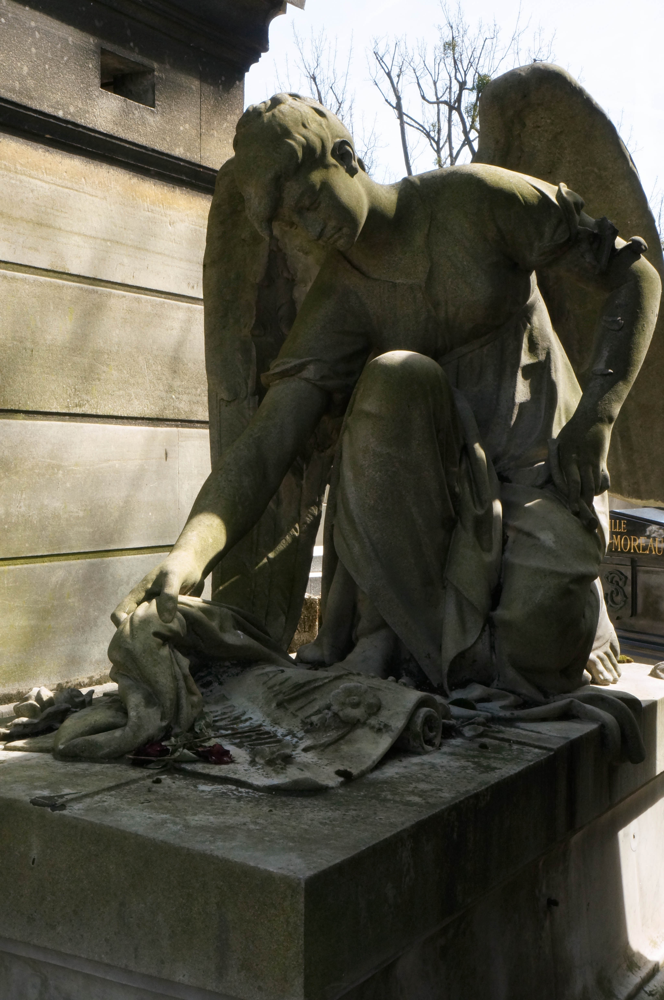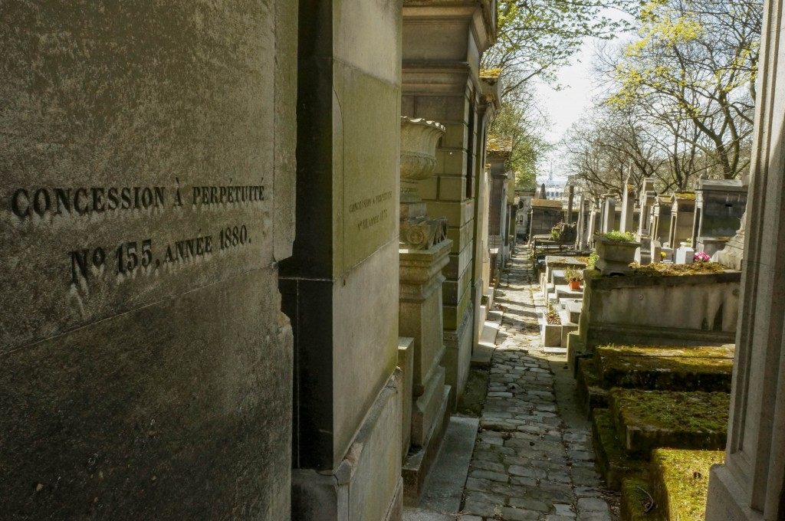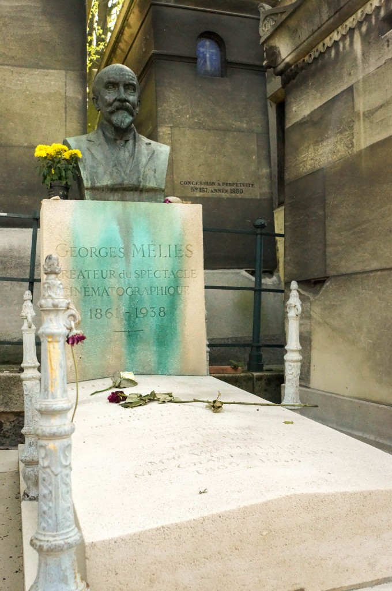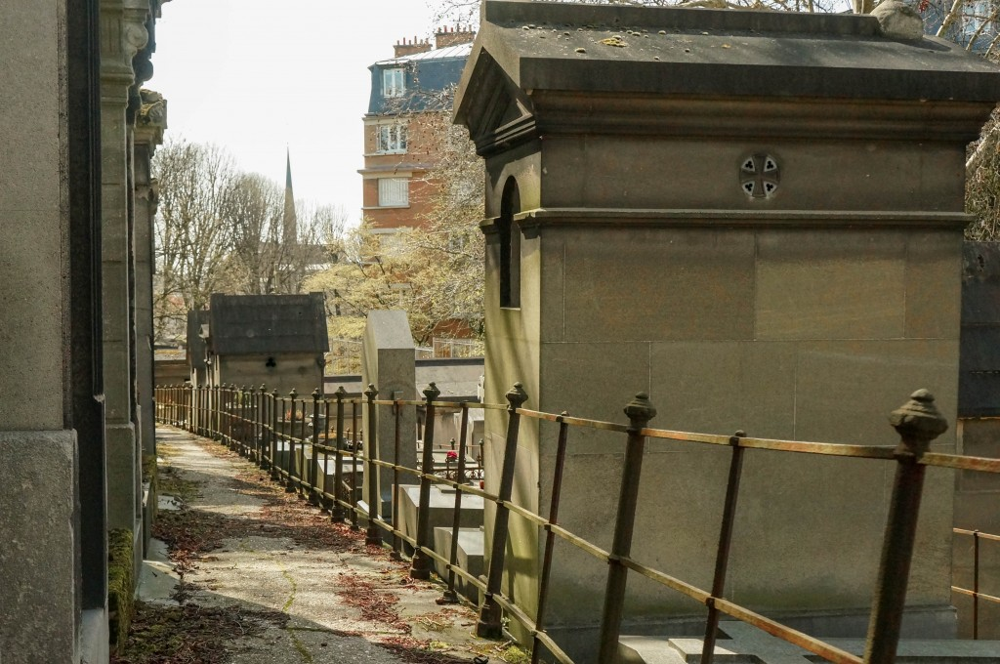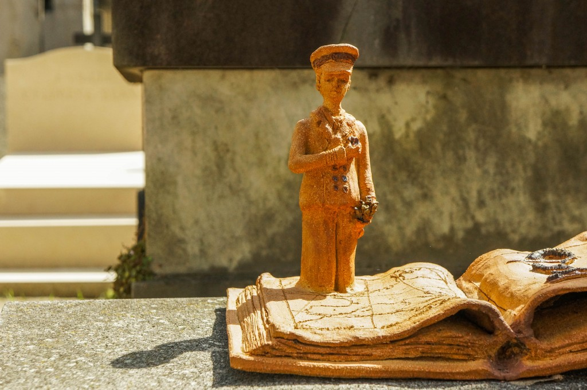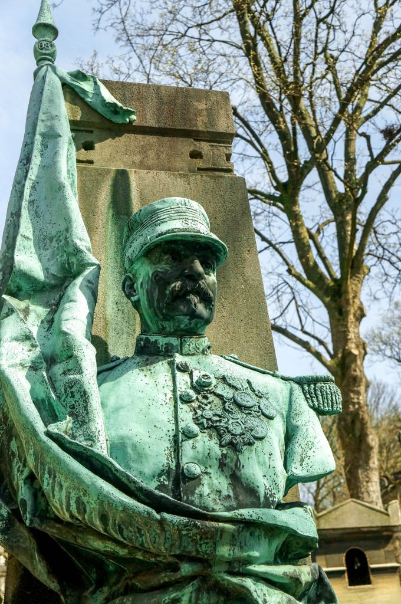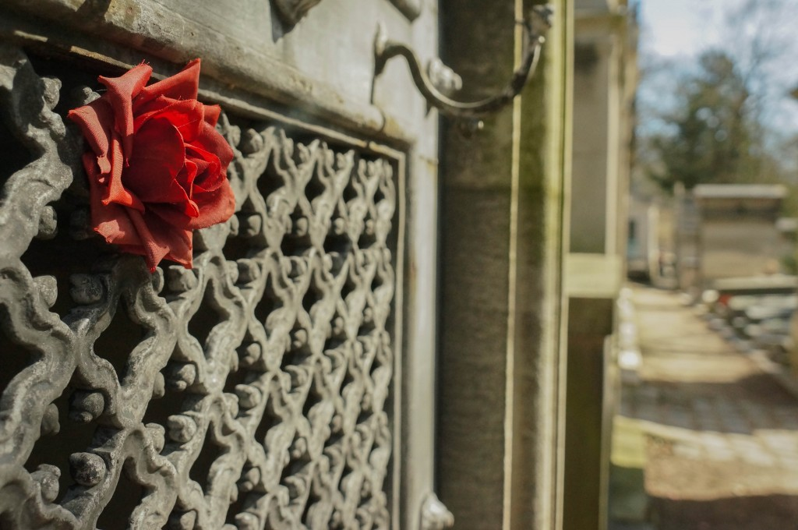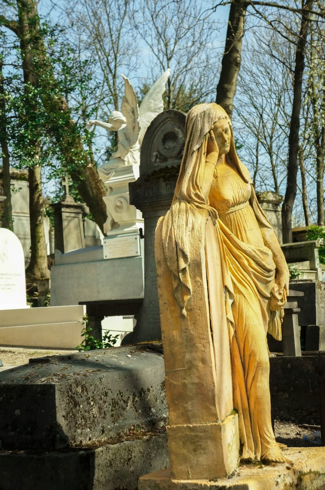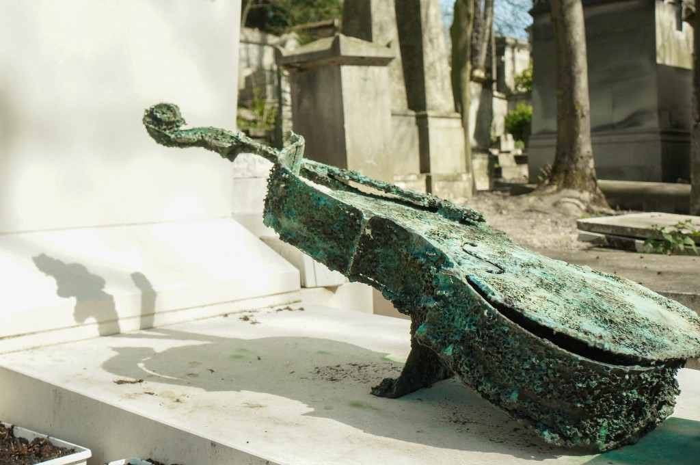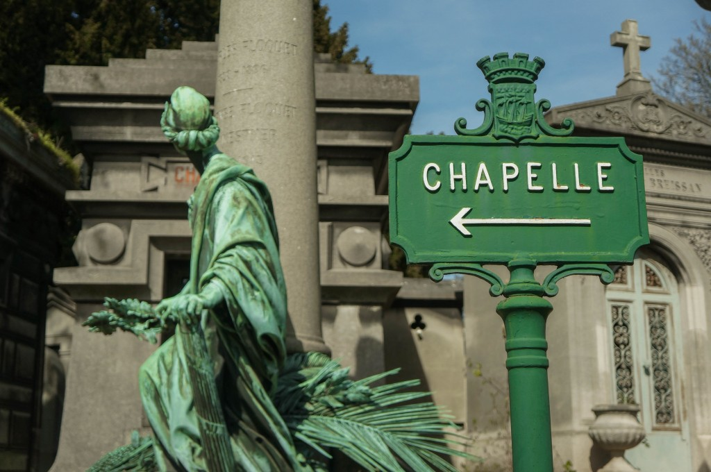
