Dimanche, c'était la fête des mères (j'espère que vous n'avez pas oublié !)

J'ai préparé une carte fleurie, colorée et dorée pour l'occasion ; je vous explique ici comment faire.

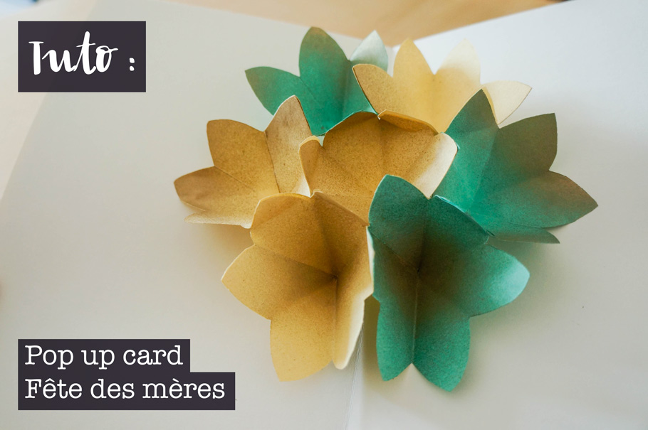

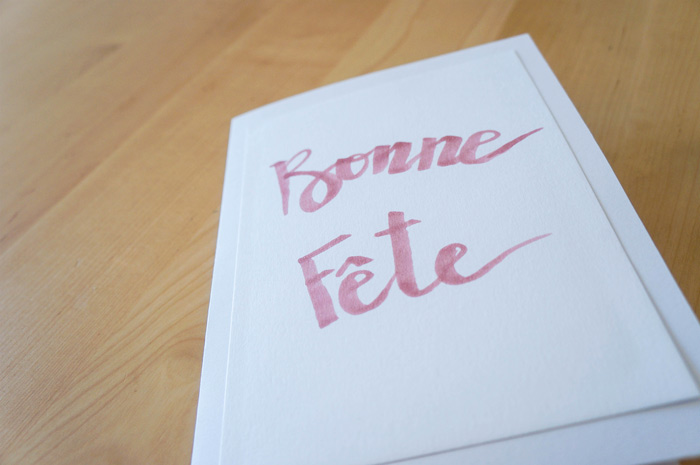

<!--more-->

## 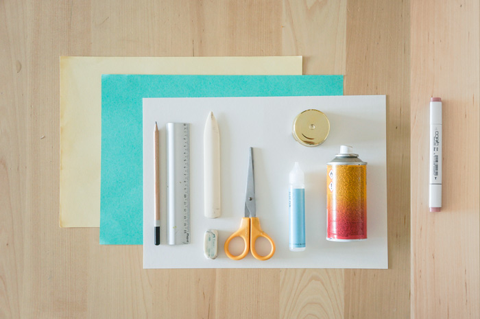

## Matériel

- 2 feuilles de papier cartonné 270g/m2 blanc - (ce sera la base de la carte)
- 2 feuilles de papier cartonné 120g/m2 colorées
- 1 crayon à papier
- 1 gomme
- 1 carnet de brouillon
- 1 pair de ciseaux
- 1 double décimètre
- 1 tube de colle
- 1 plioir
- 1 bombe de peinture Or
- 1 feutre Copic à pointe biseautée

## Étapes

1\. Sur les feuilles colorées, tracez au total 7 carrés de 10cm de côté, découpez-les

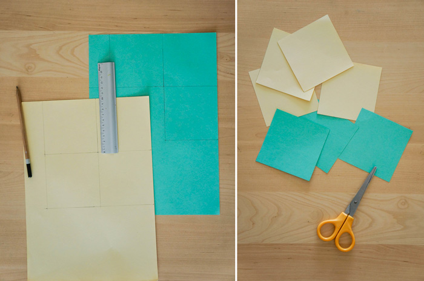

2\. Pliez les carrés dans le sens de la diagonale, une fois, deux fois, trois fois ! Vous obtiendrez de petits triangles comme ceci :

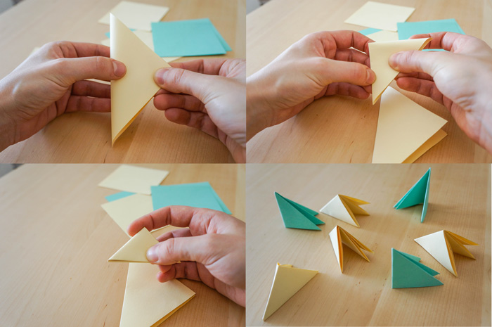

3\. Avec les ciseaux, découpez le plus petit côté en forme de pétale. Faites-le pour tous les triangles. _Attention, pour faciliter le collage, il vaut mieux qu'ils aient tous une forme identique_

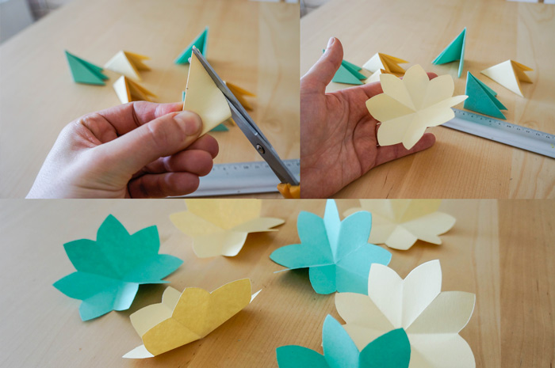4\. Une fois vos fleurs dépliées, dans une pièce bien aérée, à l'aide d'un vieux carton, protégez votre support des éclaboussures. Utilisez la peinture en bombe Dorée sur le centre ou les extrémités des pétales (avec parcimonie !) et laissez sécher.

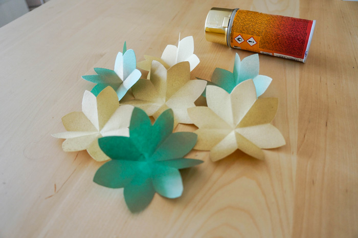

5. Donnez du volume à vos fleurs : découper un pétale puis coller les pétales des deux extrémités. Repliez la fleur en deux et laissez sécher. Répétez l'opération pour les sept fleurs.

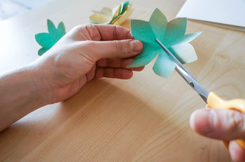

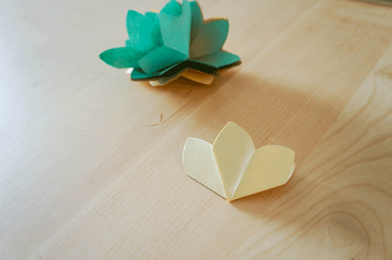

6\. Assemblez les fleurs ensemble : choisissez celle qui se trouvera au centre.

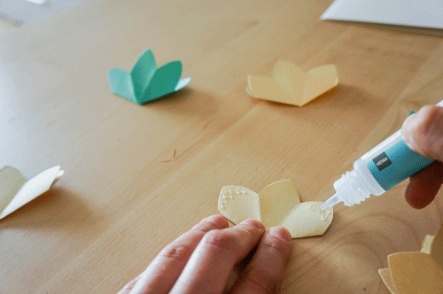

- Poser un point de colle (**toujours à l'extrémité** des pétales !) sur le pétale de gauche.
- Prenez une deuxième fleur, pivotez-la de manière à ce que son pétale de droite soit superposé à celui sur lequel vous avez déposé de la colle.
- Faites de même (symétriquement) sur le pétale de droite de la première fleur (prenez une troisième fleur, pivotez, superposez, laissez sécher.)

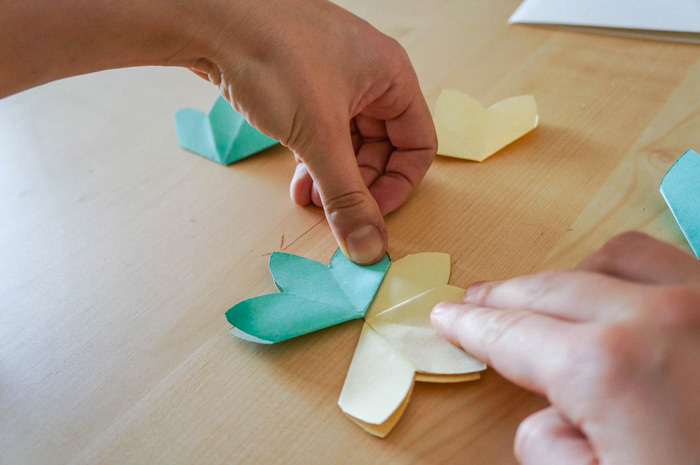

- Déposer trois points de colle (un sur le pétale droit de la fleur de gauche, un au centre sur la première fleur, un à gauche sur la fleur de droite)
- Déposer la quatrième fleur par dessus (exactement superposée à la première)

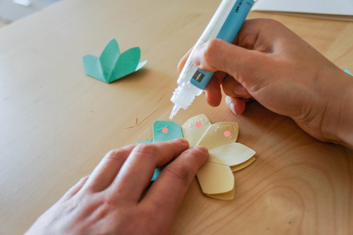

- Retournez votre ouvrage et renouvelez les étapes sur le verso de la première fleur
- Laissez sécher (c'est important !)
- Lorsque vous déplierez le montage, ça devrait ressembler à ça :

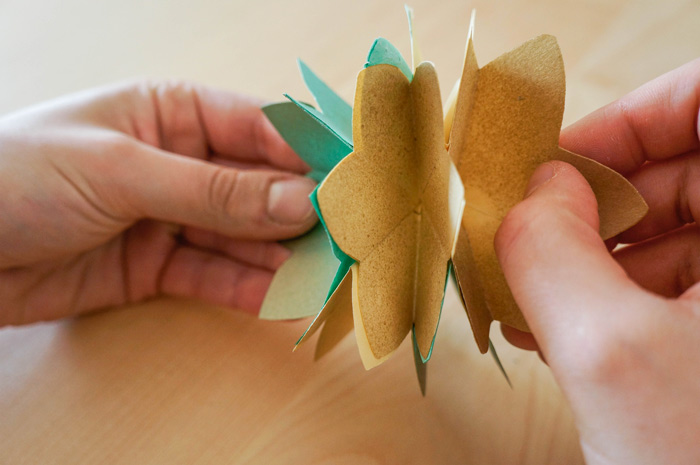

7\. Montage :

- Utilisez le double décimètre et le plioir pour faire un pli net au milieu de la feuille blanche
- Appliquez un point de colle sur l'extérieur du pétale du milieu (de chacune des deux fleurs sur les côtés (comme ci-dessous)

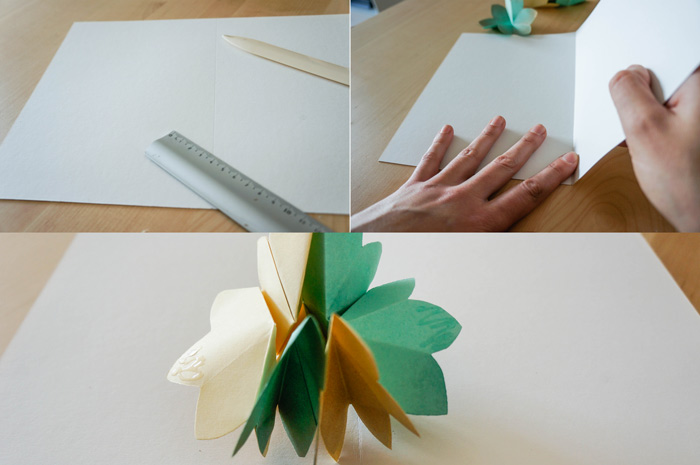

- Positionnez les fleurs (repliées) près du pliage central de la feuille blanche pour coller le premier pétale, appuyez bien.

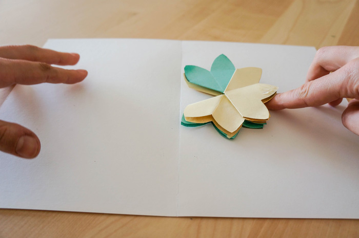

- Refermez la carte et appuyez encore pour fixer les fleurs à la carte (l'idéal est de laisser sécher sous un gros livre)

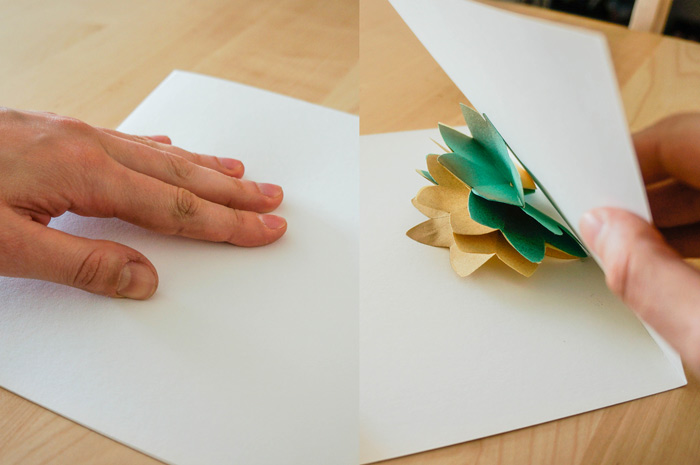

8\. Pour l'intérieur, c'est fait. Maintenant, décorez le recto de votre carte ! J'ai choisi de faire quelque chose de simple avec un feutre couleur "vieux rose" et un effet calligraphié

- Découpez la deuxième feuille blanche de manière à ce qu'elle puisse être collée à 2cm des bords du recto de votre carte.
- Sur un brouillon, préparez le texte qui aura un style calligraphié (ça évite les ratures !)
- Sur la feuille découpée, reproduisez le texte avec le feutre Copic rose
- Collez la feuille sur le recto de la carte en veillant bien à ce qu'elle soit à 2cm des bords.

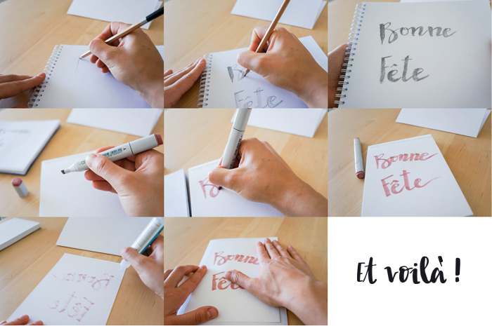

C'est sobre et dans la retenue, mais libre à vous d'ajouter des paillettes, des photos (pour les scrapbookers !), des petites feuilles autour des fleurs, etc.

Sky is the limit

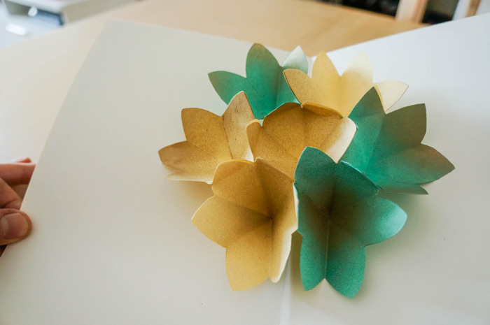
