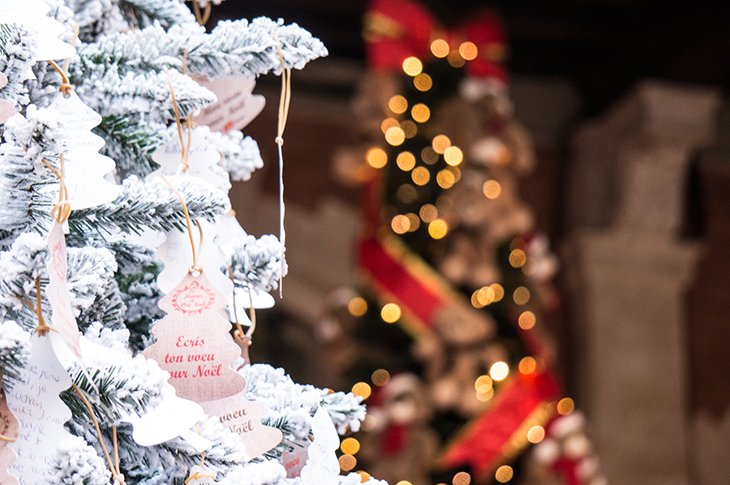
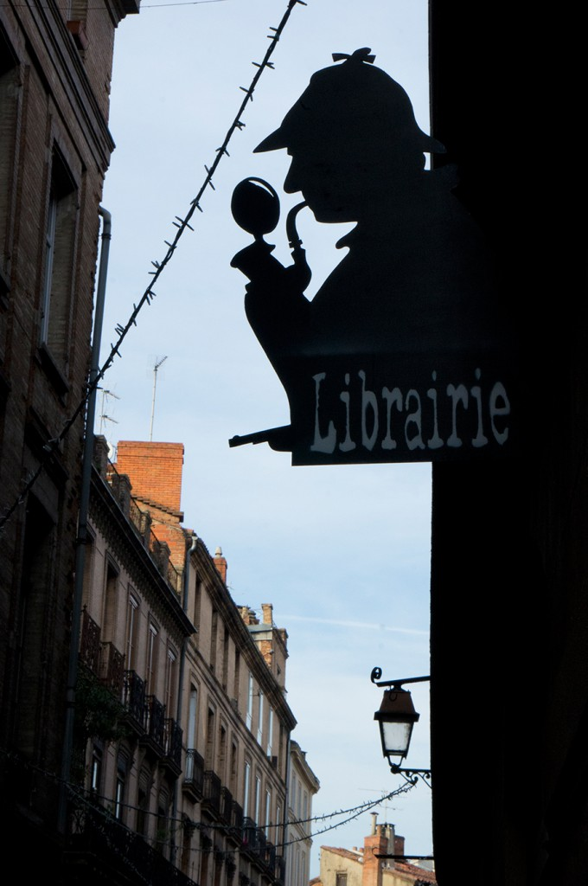
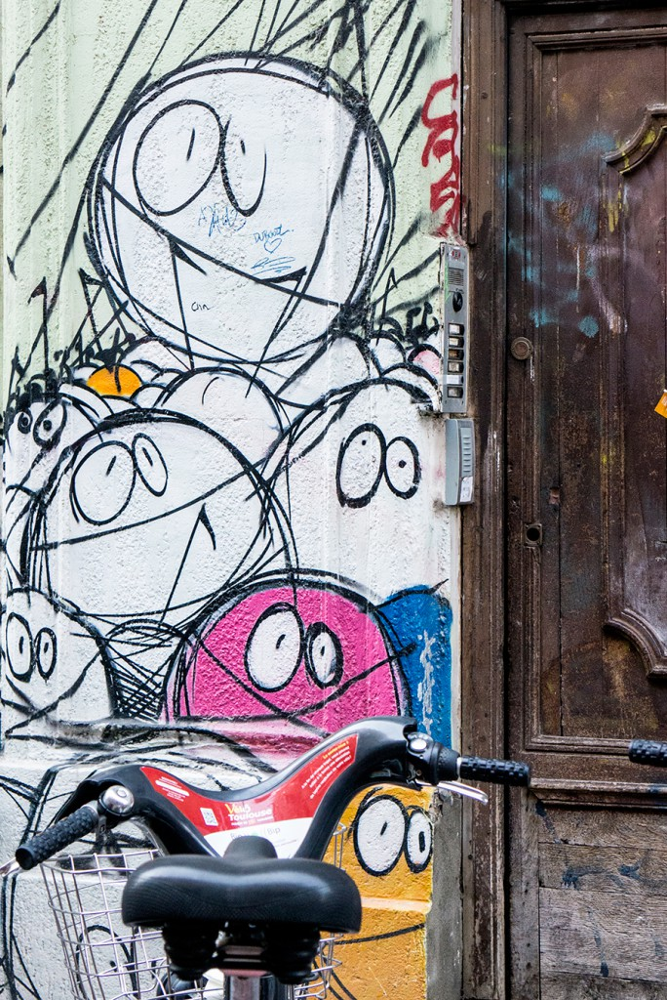
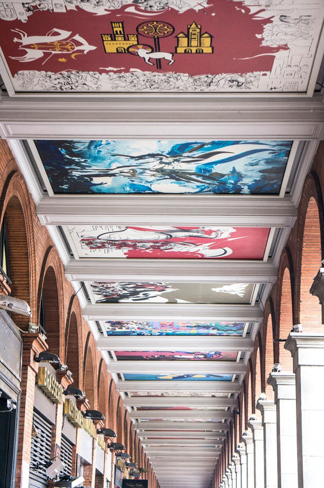
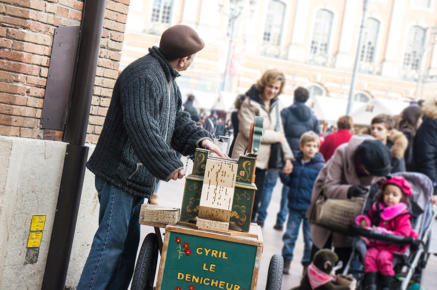
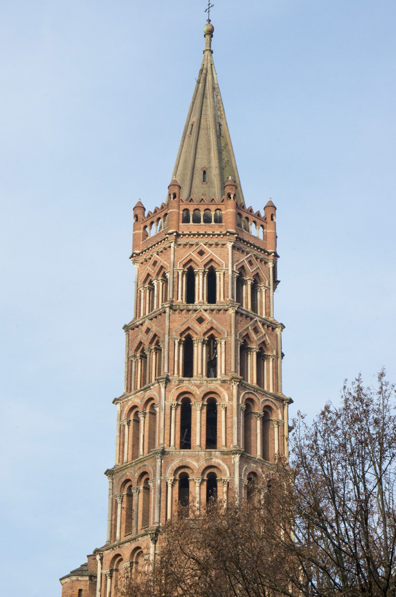
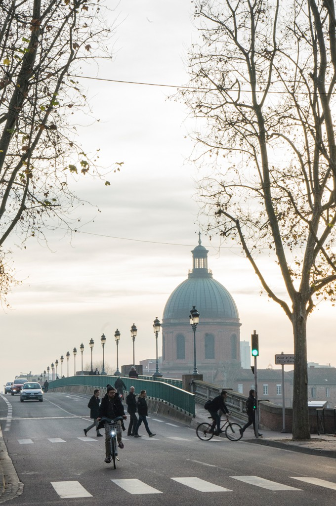
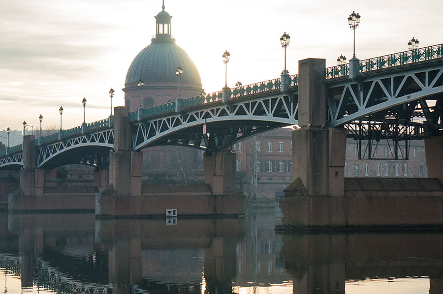
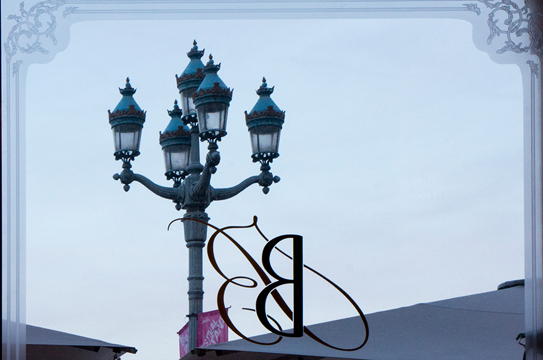

Cette année, le mois de décembre est froid mais ensoleillé dans le sud ouest ; l'occasion idéale pour faire une petite balade dans le centre de Toulouse. Le marché de Noël sur le capitole, la mairie et sa salle des Illustres, la basilique Saint-Cernin, les quais paisibles et embrumés de la Garonne... Et pour se réchauffer, un bon thé vert et une gaufre caramel-chantilly au Bibent chez Christian Constant.

<!--more-->

Bonnes fêtes de fin d'année !
