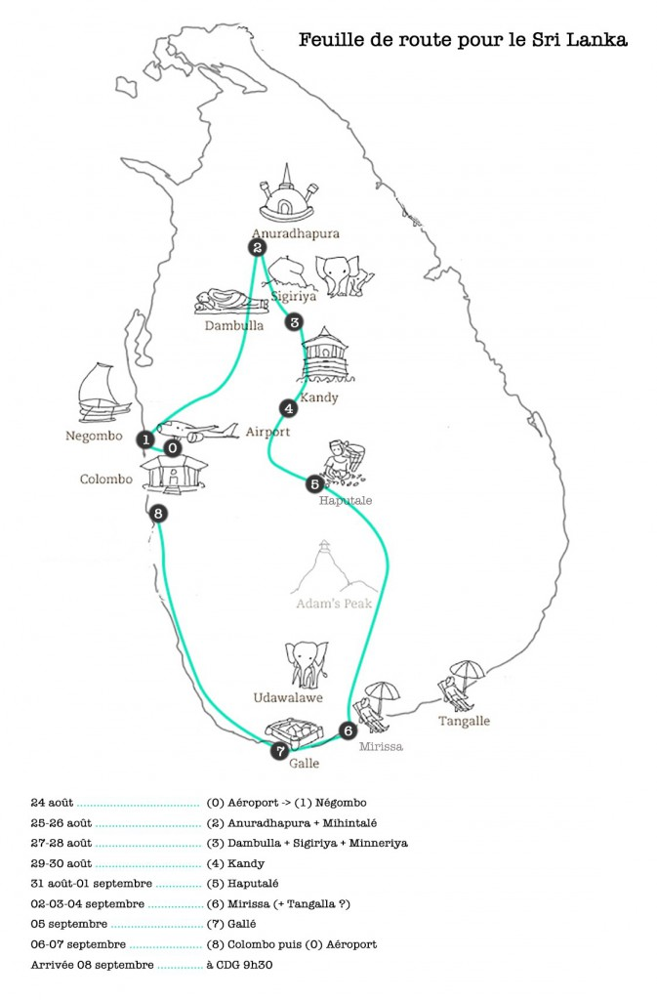

## Avant le départ

Lors de notre préparation à notre premier grand voyage, nous avons passé énormément de temps à écumer les différents blogs de voyageurs, sites de baroudeurs et autres sources de conseils et astuces. L'idée étant de rassembler des informations précieuses afin de partir sereins et parés à un maximum d'éventualités.

C'est dans cette optique que je me suis décidée à partager ici l'expérience de notre voyage. Un séjour de deux semaines, c'est difficile à synthétiser ; c'est pourquoi j'ai divisé mon récit en quatre parties, avec quelques photos choisies, prises directement de mon album public dédié au Sri Lanka.

 [Image originale de cette jolie carte trouvée sur le site feelsrilanka.com](http://www.feelsrilanka.com/locations.html)

## La feuille de route

Nous avons choisi dés le départ de passer ce séjour en mode "backpacking" (routard) et c'était notre toute première expérience en la matière. Il existe plusieurs sites dédiés à ce mode de voyage, alors plutôt que de répéter ici la tonne d'informations utiles que nous y avons trouvée, je listerai et catégoriserai en fin d'article les liens vers les pages qui nous ont été d'une grande utilité. Ci-contre, la feuille de route initiale : après avoir choisi les activités et visites que nous avions envie de faire, nous avons estimé le nombre de journées à passer dans chaque ville.

<!--more-->

## Des informations utiles :

\- Nous nous sommes beaucoup appuyés sur les informations fournies par [Lonely Planet](http://www.lonelyplanet.fr/destinations/asie/sri-lanka "Lonely Planet, Sri lnka")\* et [Wikitravel](http://wikitravel.org/en/Sri_Lanka "Wikitravel Sri Lanka")\*. Ces livres/sites contiennent pléthore d'informations intéressantes sur la culture du pays, les distances, **les moyens de transport**, les coups de coeur, les événements selon les périodes, etc. Attention, la date d'édition du livre implique clairement que certains informations comme les ordres de prix sont à titre indicatif mais pas forcément à jour. Le Lonely Planet nous a tout de même permis de nous donner une première idée des tarifs sur place pour constituer notre budget global.

\- **Côté santé**, pensez à vos (rappels de) vaccins. Ne vous y prenez pas au dernier moment : certains vaccins nécessitent une ou plusieurs injections avec une certaine durée d'intervalle, prévoyez large ! Ils sont très importants, n'hésitez pas à consulter [le site de l'Institut Pasteur](http://www.pasteur.fr/fr/map "Institut Pasteur vaccination internationale") et à [téléphoner au Service des Maladies Infectieuses et Tropicales (SMIT)](http://www.pasteur.fr/fr/sante/informations-pratiques "Coordonnées SMIT Pasteur") pour vous assurer que vous avez pris toutes les dispositions nécessaires (Hépatite A, typhoïde, anti-palu, trousse de soins, antibiotiques, etc.) On s'était interrogé sur la nécessité du vaccin antirabique : sachez que les médecins du SMIT sont les mieux placés pour répondre à vos questions.

> Note aux personnes qui souhaitent prendre un **traitement préventif antipaludéen** : on a lu et entendu beaucoup de choses sur les effets indésirables de ces médicaments. On a suivi le conseil général, à savoir : n'acheter que la marque **Malarone**, prendre les comprimés à intervalle régulier et pendant le repas estimé le plus copieux de la journée (la molécule est **liposoluble**, vous ne l'absorberez qu'en mangeant "gras") et nous n'avons subi aucun des effets secondaires. Le tarif de ce médicament est libre alors n'hésitez pas à comparer les prix dans plusieurs pharmacies (la durée du traitement se prolonge jusqu'à une semaine après le retour de voyage, donc ça constitue un budget considérable).

\- Si vous voyagez souvent, si vous vous connectez régulièrement sur le web et si vous ne l'avez pas encore fait, je vous recommande d'investir dans **un mini routeur sans fil (type [MiFi](http://en.wikipedia.org/wiki/MiFi "MiFi Wikipedia page"))**. Il suffit d'acheter une SIM de l'opérateur local de votre choix (à vous de faire un peu de recherche selon votre feuille de route pour déterminer lequel fournit une meilleure couverture réseau 3G ou 4G. On a opté pour Etisalat) avec une recharge "data" prépayée. Idéal quand on est à l'extérieur pour retrouver une adresse, relire des infos sur le lieu que l'on visite, quand l'hôtel ou la Guest Housse ne fournit pas le Wi-Fi (ou alors que la connexion est extrêmement lente) ou bien tout simplement, pour faire des recherches alors qu'on est attablés au restaurant. Testé et approuvé en Angleterre, au Portugal et au Sri Lanka.

## Des liens utiles :

### Quel sac-à-dos choisir ?

Après des mois d'hésitations ("doit-on acheter de la marque spécialisée et super chère comme l'[Osprey Farpoint 55](http://www.ospreyeurope.com/fr_fr/pack-selector/farpoint-55#.U01jD-Z_uGM "Osprey Farpoint 55 backpack")\* ?"), nous avons finalement opté pour des sacs-à-dos Decathlon qui ont parfaitement fait l'affaire. Modèle [Forclaz 40L](http://www.decathlon.fr/media/824/8243262/zoom_c0bef7ccca7a49d3a85a6777b86886cc.jpg "Backpack Forclaz 40L") pour moi, et un [Forclaz 50L](http://www.decathlon.fr/media/830/8300849/zoom_35926b68c4564842acc80c2ff3e98703.jpg "Forclaz backpack 70L") pour lui. Je n'ai pas osé prendre plus grand de peur de charger trop de poids sur mon dos, je pense que j'aurais pu prendre un 50L, ça m'aurait évité quelques heures de casse-têtes à essayer d'y faire contenir toutes mes affaires . Le critère principal pour l'achat de mon sac était "je veux qu'il s'ouvre de haut en bas. _Mention spéciale pour le vendeur du rayon montagne et sac à dos du Decathlon de Madeleine, qui est très sympa et de bons conseils : il connaît très bien les gammes de son rayon._

### Indispensable pour partir zen :

- Avoir payé son [ETA](http://www.eta.gov.lk/slvisa/visainfo/center.jsp?locale=fr_FR "ETA")\* et imprimé son mail de confirmation (à garder avec le passeport).

- Avoir une version scannée numérique de vos documents : passeport, carte d'identité.
- Quand on part à plusieurs, on peut garder une version imprimée du scan du passeport des autres voyageurs.
- Garder à disposition [les coordonnées de l'ambassade de France](http://www.ambafrance-lk.org/ "Ambassade de France au Sri Lanka").
- Pour le trajet (à plusieurs) en avion, **dispatcher les vêtements**, affaires de toilette et médicaments au cas où l'un des bagages se perdrait en chemin. Histoire que chacun ait de quoi s'habiller, se laver, se soigner au moins les premiers jours, le temps de récupérer le bagage manquant.
- Prévoir des t-shirts blancs (qui couvrent les épaules, pas des débardeurs) pour les visites dans les sites religieux. Ce geste sera apprécié par les locaux.
- Prévenir l'État de votre départ (optionnel) en [s'inscrivant sur Ariane](http://www.diplomatie.gouv.fr/fr/le-ministere-et-son-reseau/evenements-et-actualites-du/article/vous-partez-en-voyage-inscrivez "Inscription sur Ariane") et y désigner une personne à prévenir en cas d'urgence.
- **Avertir sa banque** que l'on part en voyage au Sri Lanka pour ne pas se retrouver avec une carte bloquée (suite à des retraits d'argents qu'elle aura considérés comme suspicieux).
- Noter les coordonnées de **l'assistance medicale** (dont vous bénéficiez avec une carte visa ou master card) pour tout souci de santé une fois sur place.
- [Noter les numéros d'urgence locaux (police, pompiers, etc.)](http://www.diplomatie.gouv.fr/fr/conseils-aux-voyageurs/conseils-par-pays/sri-lanka-12338/ "Numéros d'urgence Sri Lanka")
- [Se renseigner sur l'actualité Sri Lankaise (la sécurité) avant de partir](http://www.diplomatie.gouv.fr/fr/conseils-aux-voyageurs/conseils-par-pays/sri-lanka-12338/ "Info Ministère affaires étrangères").

### Que mettre dans son sac-à-dos ?

- [une suggestion de liste (pour femmes)](http://www.ricksteves.com/travel-tips/packing-light/packing-list-women "Remplir son sac-à-dos de voyage - homme")\*

- [une suggestion de liste (pour hommes)](http://www.ricksteves.com/travel-tips/packing-light/ricks-packing-list "Remplir son sac-à-dos de voyage - homme")\*
- [Comment optimiser la place dans son sac à dos](http://www.youtube.com/watch?v=cjcbCBwZ420 "Housses de rangement Cube - packing tips")\* avec des équivalents de [housses Décathlon moins chères](http://www.decathlon.fr/media/820/8208931/zoom_400PX_asset_75292462.jpg "Housses de rangements vêtements")
- [Quels vêtements choisir ?](https://www.lonelyplanet.com/thorntree/forums/asia-indian-subcontinent/topics/dress-for-female-travelers-to-sri-lanka "What to wear in Sri Lanka")\*

### Hotel ou Guest House ?

- [Agoda](http://www.agoda.com/fr-fr "Agoda") et [Tripadvisor](http://www.tripadvisor.fr/ "Tripadvisor") sont complémentaires

### Encore de la lecture

- [WIKITRAVEL](http://wikitravel.org/en/Sri_Lanka "Wikitravel Sri Lanka")\* est la meilleure source d'infos pour chaque ville et chaque déplacement
- Un aperçu de [la nourriture Sri-lankaise](http://letitgonow.fr/petits-plats-sri-lankais/ "La nourriture sri-lankaise")
- [Expériences d'autres voyageurs au Sri Lanka](http://leblogdebeatriceq.blogspot.fr/2014/04/trois-semaines-au-sri-lanka-lile-aux_3.html "Voyage au Sri Lanka")
- [Des suggestions d'itinéraires](http://www.roughguides.com/destinations/asia/sri-lanka/itineraries/ "Suggestions d'itinéraires")\*
- [La feuille de route qui nous a inspirés](http://www.jaimelemonde.fr/2013/01/planifier-votre-voyage-au-sri-lanka/ "Feuille de route ")
- [Des astuces pour dormir dans les aéroports](http://www.sleepinginairports.net/ "Dormir dans les aéroports")\*
- [Les rudiments de la langue Cingalaise pour briller en société (ou juste se faire comprendre)](http://wikitravel.org/en/Sinhala_phrasebook "Rudiments du Cingalais")\*
- [Le choc culturel](http://thiswritingbusiness.wordpress.com/2013/05/30/culture-shock-sri-lanka/ "Le choc culturel Sri-lankais")\* raconté par un blogueur

\* lien en anglais

## Retrouvez tous les articles concernant notre voyage au Sri-Lanka

- [Voyage au Sri Lanka : prologue](https://blog.cissou.me/2014/09/voyage-au-sri-lanka-prologue/ "Voyage au Sri Lanka : infos et astuces")
- [Negombo, Mihintale, Anuradhapura](https://blog.cissou.me/2014/09/negombo-mihintale-anuradhapura/ "Negombo, Mihintale, Anuradhapura")
- [Minneriya, Sigiriya, Dambulla](https://blog.cissou.me/2014/09/minneriya-sigiriya-dambulla/ "Minneriya, Sigiriya, Dambulla")
- [Kandy, Haputale, Dambatenne](https://blog.cissou.me/2014/09/kandy-haputale-dambatenne/ "Kandy, Haputale, Dambatenne")
- [Mirissa, Colombo](https://blog.cissou.me/2014/09/mirissa-colombo/ "Mirissa, Colombo")
- [Voyage au Sri Lanka : épilogue](https://blog.cissou.me/2014/10/voyage-au-sri-lanka-epilogue/ "Voyage au Sri Lanka : Les trucs qu'on retient")
