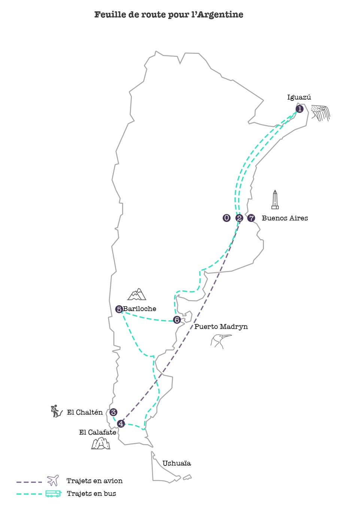

Deux ans après [la découverte du Sri Lanka](https://blog.cissou.me/2014/09/voyage-au-sri-lanka-prologue/), nous avons décidé d'explorer un autre continent. L'Amérique du Sud offre des milliers de panoramas et de monuments, mais lorsqu'on se limite à un séjour de trois semaines, le choix de la destination et du parcours est un petit casse-tête ; nous avons finalement jeté notre dévolu sur l'Argentine. Ce pays immense est bordé d'une part par les Andes et de l'autre par l'océan : les reliefs, les climats, les paysages sont  tellement différents d'une région à l'autre que nous savions déjà que nous aurions les mêmes sensations qu'en traversant plusieurs pays différents.

## Avant le départ

Armés du Lonely Planet et de dizaines de liens vers des blogs, des forums, des calculateurs de budgets, nous avons englouti un maximum d'informations sur le pays, les transports, les lieux à visiter et les spécialités locales pour définir notre feuille de route et le budget approximatif pour ces trois semaines tant attendues.

 

La première bonne surprise (par rapport au voyage précédent) c'est la disponibilité des informations en ligne (pour presque tout). Je me souviens qu'au Sri Lanka, nous somme partis sans connaître à l'avance quels bus ou quels trajets nous allions faire pour passer d'un point de la feuille de route au suivant. Ça nous avait demandé beaucoup plus de capacité d'adaptation et d'improvisation ! En argentine, les voyages en bus sont listés sur le site [plataforma10](http://www.plataforma10.com.ar/) (et peuvent même être réservés à l'avance, "but where's the fun in that?"). Il y a aussi [Rome2Rio](https://www.rome2rio.com/fr/s/Buenos-Aires/Puerto-Iguaz%C3%BA) et [wikiTravel](http://wikitravel.org/en/Puerto_Iguaz%C3%BA#By_bus) qui répertorient les différents transports disponibles pour aller d'un point à un autre. Parfait, donc, lorsqu'un n'a que 3 semaines pour optimiser les temps de trajet, connaître les différents horaires et savoir combien de nuits seront passées dans un bus et ou dans une auberge.

Car oui, la superficie de l'Argentine fait 5 fois celle de la France ! Pour changer de région, le compteur des km monte vite ; sachant qu'il y a très peu de trains, il reste le choix entre faire le voyage en bus (plus long mais plus économique, même en "coche cama", siègle inclinable, plus confortable et spacieux qu'une place 1ère classe d'un TGV chez nous) ou en avion (plus rapide mais 2 à 4 fois plus cher, sachant qu'en général les vols nationaux ont une correspondance systématique à Buenos Aires).

Petit bémol cependant : que ce soit dans les guides ou sur internet, les tarifs annoncés sont quasi systématiquement en dessous de la réalité. L'Argentine connaît l'inflation depuis plusieurs années. Prévoyez un peu de marge dans votre budget !

## La feuille de route définitive

Devant tant de possibilités et avec seulement 21 jours pour tout faire, nous avons été obligés de faire des choix. Après une première sélection et un savant calcul des temps de trajets, nous avons dû abandonner, par exemple, l'idée de passer parmi les glaciers d'Ushuaïa (île tout au Sud), d'aller fouler les étendues de sel près de Salta (dans la région Nord Ouest), ou encore de terminer le voyage par quelques jours de farniente dans les plages de la Pampa. Mais pas de regrets, notre programme était bien chargé et nous n'avons pas été déçus du voyage ! Nous avons donc testé pour vous **Iguazú**, **El Calafate**, **El Chaltén**, **Bariloche**, **Puerto Madryn** et bien sûr, **Buenos Aires**. <!--more-->

## Au programme

- Des cascades, des papillons et des arcs-en-ciel
- Des glaciers plus bleus que les yeux d'Emma Stone
- Du bateau
- Du trekking
- Du VTT
- Des manchots, des baleines et des mygales
- Des monuments, des brocantes, des musées
- De la marche, de la marche et de la marche

## Côté santé

La seule zone de l'Argentine susceptible de poser problème était le Nord-Est, vers Iguazú. À cause de son climat humide, la présence des moustiques y est plus importante ;  c'est le seul endroit où risque de contracter la fièvre jaune est élevé. On peut compter sur la chance et les probabilités, mais vu le sérieux des symptômes (on ne parle pas d'une tourista ou de démangeaisons, là, mais de céphalée, de myalgie et d'hémorragie), nous avons préféré ne pas prendre de risque et opté pour la vaccination.

## Côté pratique

### Quel matériel ?

Nous avons gardé notre équipement de baroudeurs débutants : sac-à-dos Forclaz, housses de rangement, vêtements qui sèchent vite, etc.

### Côté cash ?

Nous avons opté pour le retrait sur place. Il y a des banques qui permettent de payer dans la devise souhaitée au taux du moment, sans taxe supplémentaire. Lorsque nous pouvions, nous avons payé par carte ; nous avons systématiquement retiré du cash dans des "cajeros automáticos" (ATM)  parce que les compagnies de bus font une réduction de 10% aux voyageurs qui payent "con efectivo" (en espèces). Quand on prévoie de faire plusieurs trajets de bus pour en moyenne 100 euros par personne chacun, ça vaut le coup de payer en cash !

**Attention, notez que** :

- Il y avait une limite de 2 000 ARS (~120 EUR) par retrait. Parfois, nous avons dû faire plusieurs retraits d'affilée.
- Les ATM prennent une commission d'environ 90 ARS (ça change de jour en jour).
- Sur les ATM et certains TPE, il faut souvent choisir le type de compte pour payer par CB. Dans nos souvenirs, il faut choisir "corriente" (compte courant / checking account). Testez les différents choix, et notez le pour les prochaines fois.
- Nous avions en permanence 2 000 à 6 000 ARS en backup dans nos affaires, surtout si des excursions étaient prévues (qui coûtent et ne peuvent pas être réglées par CB). En général, il fallait compter le coût de l'activité/ l'excursion + 2 000 ARS de monnaie pour la nourriture et les dépenses diverses.

### Quand partir ?

Toutes nos sources d'informations recommandaient de préférer le printemps (dans l'hémisphère nord = novembre)

### Quels vêtements choisir ?

Au printemps, la météo en Argentine est… Inégale, selon là où on se trouve (évidemment !) Sachant que nous avions choisi de traverser le pays du Nord au Sud, nous avons dû prévoir d'emporter de tout. Du court et du long, du chaud et du léger, des chaussures de montagne et des sandales. Difficile de tout faire entrer dans nos sacs, il a fallu faire des compromis (notamment au niveau du "swag"). Voici la liste des vêtements qui m'ont été utiles pendant ces trois semaines :

**Rappel météo**

Pour le Nord du pays  - Iguazú, Buenos Aires, Puerto Madryn - 27°c à 32°c

Pour le Sud du pays et la Patagonie  - El Calafate, El Chaltén, Bariloche - 6°c à 12°c, TELLEMENT DE VENT (et parfois, de la pluie ou de la neige)

- 4 tshirts manches courtes (ou débardeurs)
- 1 tshirt manches longues uniqlo heat tech
- 1 tshirt manches longues en laine
- 2 pantalons en jeans zippables (en pantacourt)
- 2 leggings 7/8 (le confort dans les bus <3)
- 1 short
- 1 coupe-vent imperméable (avec polaire intérieure amovible)
- 1 bonnet + 1 bandeau + 1 écharpe + 1 paire de gants fins
- 2 paires de chaussettes uniqlo heat tech
- 1 paire de merrell (10h de trekking non-stop et 0 ampoules)
- 1 paire de birkenstock (n'oubliez qu'on est des grands marcheurs quand on voyage)

**Qu'est-ce qui m'a manqué ?**

Du swag. Quand on passe au moins cinq jours dans la capitale, on finit par se lasser des pantalons de baroudeurs, des chaussures de montagne et des birkenstock (même à paillettes). C'est sûrement un peu superficiel, mais c'était comme passer 3 semaines en jogging : confortable mais niveau présentation, peut mieux faire ! Peut-être qu'une simple robe en plus aurait suffi.

## Indispensable pour partir zen :

- Pas besoin de visa pour les français qui partent visiter l'Argentine (jusqu'à maintenant)
- Pour visiter les lieux limitrophes avec d'autres pays, renseignez-vous à l'avance. Par exemple, pas besoin d'un visa pour faire le côté brésilien des chutes d'Iguazú quand on prévoie de faire l'aller-retour dans la journée. Bonus, on peut faire tamponner son passeport à la frontière brésilienne ! (Pour la frime.)
- Avoir une version scannée numérique de vos documents : passeport, carte d'identité.
- Quand on part à plusieurs, on peut garder une version imprimée du scan du passeport des autres voyageurs.
- Garder à disposition les coordonnées de [l'ambassade de France](http://www.embafrancia-argentina.org/).
- Pour le trajet (à plusieurs) en avion, **dispatcher les vêtements**, affaires de toilette et médicaments au cas où l'un des bagages se perdrait en chemin. Histoire que chacun ait de quoi s'habiller, se laver, se soigner au moins les premiers jours, le temps de récupérer le bagage manquant.
- N'oubliez jamais la crème solaire
- Prévenir l'État de votre départ (optionnel) en [s'inscrivant sur Ariane](http://www.diplomatie.gouv.fr/fr/le-ministere-et-son-reseau/evenements-et-actualites-du/article/vous-partez-en-voyage-inscrivez "Inscription sur Ariane") et y désigner une personne à prévenir en cas d'urgence.
- **Avertir sa banque** que l'on part en voyage en Argentine pour ne pas se retrouver avec une carte bloquée (suite à des retraits d'argents qu'elle aura considérés comme suspicieux).
- Noter les coordonnées de **l'assistance médicale** (dont vous bénéficiez avec une carte visa ou master card) pour tout souci de santé une fois sur place.
- Noter [les numéros d'urgence locaux (police, pompiers, etc.)](http://www.diplomatie.gouv.fr/fr/conseils-aux-voyageurs/conseils-par-pays/argentine/#complements)
- Se renseigner sur [l'actualité (sécurité)](http://www.diplomatie.gouv.fr/fr/conseils-aux-voyageurs/conseils-par-pays/argentine/) avant de partir.

### Transports

- [plataforma10](http://www.plataforma10.com.ar/)
- [Rome2Rio](https://www.rome2rio.com/fr/s/Buenos-Aires/Puerto-Iguaz%C3%BA)
- [Aerolineas](http://www.aerolineas.com.ar/Welcome)
- [Latam](http://www.latam.com)

Nos trajets de bus duraient en moyenne 20h (et oui ! Les distances sont longues), alors même s'ils se déroulaient en partie de nuit, nous avions prévu de quoi passer le temps. Spotify et audible sur le téléphone, séries et films sur la tablette, liseuse, tricot, mots fléchés… À chacun ses activités (pas trop encombrantes dans le sac) ! Le paysage qui défile est tellement fou que je n'ai jamais fini ni livre, ni audiobook, ni tricot dans les bus. Sans oublier qu'ils étaient tous équipés de télés et diffusaient des films (en VOST-ES) presque tout le long.

### Hotel ou Guest House ?

- [Hostelworld](http://www.hostelworld.com/) et Booking nous ont été indispensables

### Encore de la lecture

- [WIKITRAVEL](http://wikitravel.org/en/Argentina "Wikitravel Argentina")\* est la meilleure source d'infos pour chaque ville et chaque
- [South America packing tips](http://www.back-packer.org/south-america-packing-list/)
- Pénélope Bagieu : celle qui m'a fait [rêver du Fitz Roy](http://www.penelope-jolicoeur.com/argentine/page/7/)

Vous l'aurez peut-être remarqué, on y voit trois points de passage à Buenos Aires. La capitale reste un point de chute principal, notamment en ce qui concerne les trajets en avion.

> Info : il y a plusieurs aéroports à Buenos Aires. Nous sommes passés par Ezeiza pour les vols internationaux et par l'aeroparque Jorge-Newbery pour nous rendre au sud de la Patagonie

Nous avons atterri de bon matin - 8h heure locale, midi en France -, à l'aéroport Ezeiza accueillis par un grand soleil et un bon 28°. Inutile de préciser que pour un 5 novembre, c'était un début de vacances franchement agréable ! J'ai très vite rangé mes chaussures fermées et enfilé mes Birkenstock : à peine arrivés nous nous étions déjà fixé plusieurs missions : retirer de l'argent, rejoindre le centre ville, trouver une SIM data prépayée pour notre routeur wifi _MiFI_ et enfin, partir pour Iguazú.

## Les basiques

### Retirer de l'argent

Trouver un distributeur automatique de billets (ou ATM, ou "Cajero Automático") à Buenos Aires n'est pas bien compliqué, **cependant** voici quelques infos importantes à noter :

\- Il y a une limite de 2 000 ARS (~120 EUR) par retrait. - Les ATM prennent une commission d'environ 90 ARS (ça change de jour en jour). - Sur les ATM et certains terminaux de paiement par CB, il arrive qu'on doive spécifier le type de compte. De mémoire, nous utilisions "corriente" (compte courant / checking account). Testez les différents choix si jamais, et notez le bon pour les prochaines fois.

### Pas de SIM data pour le MiFi

Après avoir questionné les vendeurs de toutes les boutiques de tous les opérateurs de la **_Calle Florida_**, rue commerçante principale, nous nous sommes résignés : impossible de trouver un carte SIM qui ne fournit que de la data. Le routeur MiFi ne nous sera d'aucune utilité. Plan B, nous avons opté pour une carte SIM prépayée classique Movistar rechargeable en kioske, à mettre directement dans l'un de nos téléphones (on pourrait toujours faire un partage de connexion à partir de là).

### Payer les longs trajets de bus

Quelques pesos en poche, internet sur nos smartphones, nous avons marché jusqu'au Terminal de bus **_Retiro_**, trouvé un guichet (le choix des compagnies de bus ne manque pas) et réservé notre "cama bus" pour Iguazù (départ le jour-même à 14h, timing idéal). Pour les curieux, c'est avec Via Bariloche que nous avons fait cette partie du voyage.

> Astuce : la plupart des établissements font une réduction de 10% si le règlement est en _effetivo_ (espèces). Ça vaut pour les bus, souvent les hôtels, et parfois les restaurants. D'où la nécessité de retirer suffisamment de cash !

> Autre astuce : pour ces trajets en bus, si comme nous vous connaissez la date du retour en bus, acheter l'aller-retour permet d'économiser 20% sur le tarif initial.

Le bus était très confortable : fauteuils larges, moelleux et inclinables à 140°. Nous nous sommes sans problème écroulés de sommeil. Les bus disposent de télés sur lesquelles ils diffusent des films plutôt récents en VO (ST en espagnol) ; et puis un stewart ou une hôtesse servira des plateaux-repas et des boissons pour le goûter, le dîner et le petit déjeuner.

## Retrouvez tous les articles concernant notre voyage en Argentine

- [Voyage en Argentine : prologue](https://blog.cissou.me/2017/05/voyage-en-argentine-prologue/ "Voyage en Argentine : infos et astuces")
- [Iguaçu, les chutes du côté Brésilien](https://blog.cissou.me/2017/07/buenos-aires-iguacu/ "Iguaçu, les chutes du côté Brésilien")
- [Iguaçu, les chutes du côté Argentin](https://blog.cissou.me/2017/07/les-chutes-diguazu-cote-argentin/ "Iguazú, les chutes du côté Argentin")
- [El Chaltén et le Fitz Roy](https://blog.cissou.me/2017/08/el-chalten/ "El Chaltén et le Fitz Roy")
