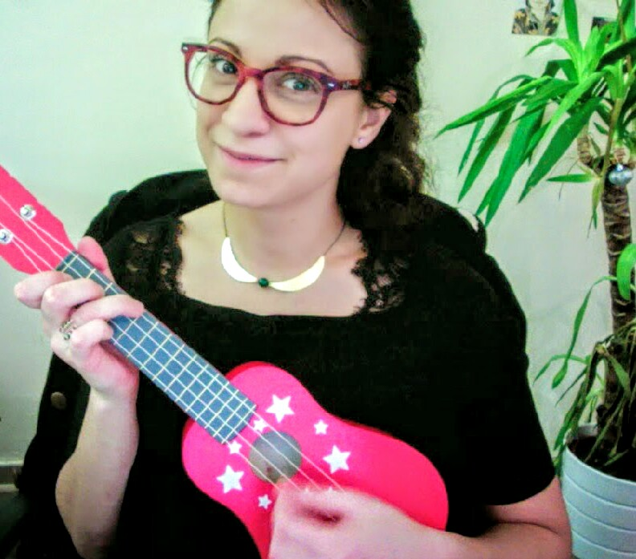

_En Novembre 2006, dans le cadre d'un projet d'animation 3D de Master, je dessinais les planches d'un storyboard en nuances de gris. Tout a commencé avec la tablette graphique de ma coloc en fait ! Aujourd'hui, avec mes dessins, mon appareil photo, mes voyages et mes DIY, j'essaie (ponctuellement) de mettre un peu de vie sur ce blog et de partager ce qui me transporte._

Dans la vraie vie, je suis [développeuse Front-End](http://www.cissou.me "Développeuse Front-End chez Maisons du Monde") chez [Jobteaser](https://www.jobteaser.com "Maisons du Monde"). Je fais semblant de jouer du ukulélé, je cours (un peu), je suis donneuse de sang, j'adore voyager, je prends soin de mes plantes ; j'aime découper, tricoter, peindre, coller, [prendre des photos](http://photos.cissou.me "Photos de Céline Coelho"), [bouturer](https://www.facebook.com/groups/HelloJungle/), partager, essayer de nouvelles choses, laisser la pagaille et répandre des paillettes.\*

\---

\*\[ENG\] In real life, I'm a [Front-end developer](http://www.cissou.me "Front-End dev at Maisons du Monde") at [Jobteaser](https://www.jobteaser.com "Maisons du Monde"). I pretend to play the ukulele, I jog (a little), I'm a platelets donor, I really like traveling, I take good care of my plants ; I love to cut out paper, knit, paint, glue, take pictures, grow anything vegetal from a cutting, share, try new things, make a mess and sprinkle glitter everywhere.

